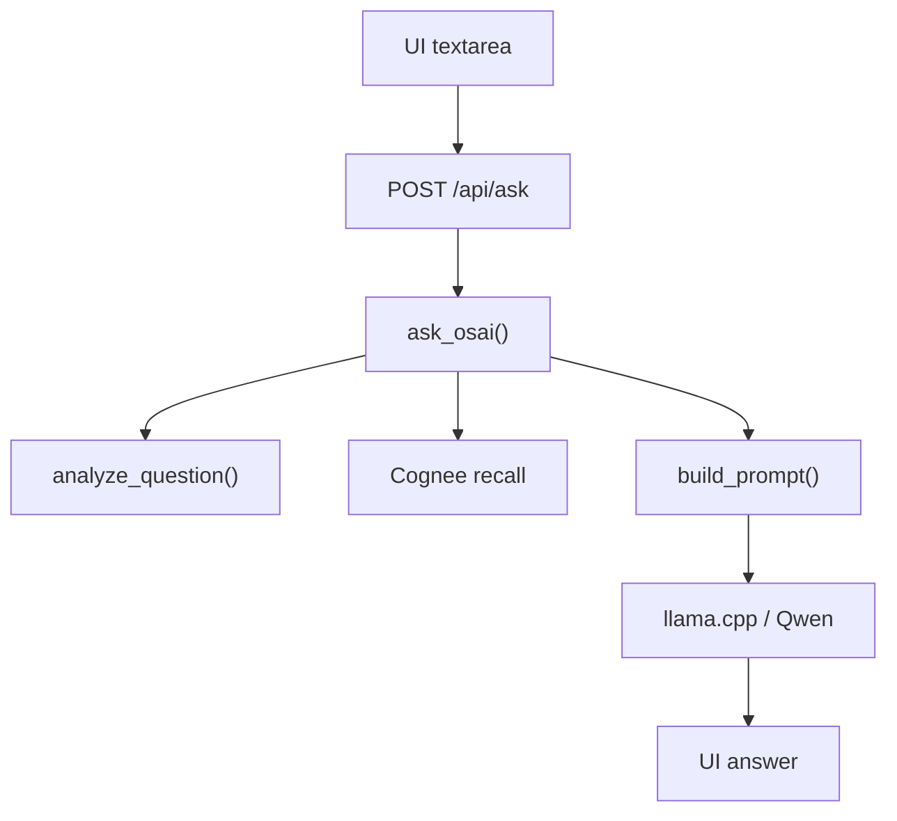
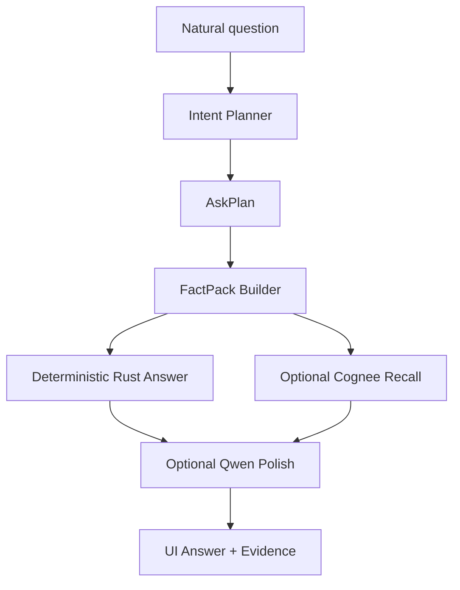

# Intent Planner + FactPack Builder

This phase makes Ask OSAI faster, clearer, and more predictable on low-resource machines.

The core idea:

```text
Do not send the whole server to Qwen.
Use Rust to understand the user's question first.
Send Qwen only the exact facts needed to answer that question.
```

Qwen should be the natural-language reasoning layer. Rust should remain the source of truth for facts, intent detection, severity, command suggestions, and guardrails.

## Current Ask OSAI Flow

Today the flow is already close:



Relevant files:

| Area | File | Current responsibility |
|---|---|---|
| UI input | `web/index.html` | Textarea `reasonQuestion` and Ask button |
| UI request | `web/app.js` | `askReasoning()` sends `{ question, use_ai }` |
| API route | `src/main.rs` | `/api/ask` calls `ask_osai()` |
| Ask orchestration | `src/ask.rs` | Loads env, calls intent, Cognee, Qwen, fallback |
| Intent matching | `src/intent.rs` | Maps words like cpu, ram, disk, services to `QueryInsight` |
| Final UI output | `web/app.js` | Shows answer, mode, AI used, insights, manual checks |

## Current Problem

The user can ask:

```text
what is the update on service
what my cpu doing
what about ram
```

These are human questions. They are messy, incomplete, and sometimes grammatically uneven. That is normal.

The bad approach is to send the full sentence plus full server context to Qwen and hope Qwen chooses the right part.

That causes:

- large prompts
- slow inference
- llama.cpp request cancellations
- more RAM and CPU pressure
- more chance of hallucination
- less predictable answers

The better approach is:

```text
User sentence -> Rust intent planner -> focused facts -> compact Qwen prompt -> natural answer
```

## Target Architecture



The important change is that Qwen does not decide what data to inspect. Rust decides that first.

## New Concept 1: AskPlan

`AskPlan` is Rust's understanding of the user's question.

Example:

```rust
pub struct AskPlan {
    pub original_question: String,
    pub normalized_terms: Vec<String>,
    pub intents: Vec<Intent>,
    pub response_style: ResponseStyle,
    pub depth: AnswerDepth,
    pub use_cognee: bool,
    pub fact_budget: FactBudget,
    pub llm_max_tokens: u64,
}
```

Example enum:

```rust
pub enum Intent {
    ServerOverview,
    Cpu,
    Memory,
    Storage,
    NetworkPorts,
    Processes,
    Services,
    Databases,
    Kubernetes,
    GitLab,
    Findings,
    Actions,
}
```

`AskPlan` answers these questions:

- What is the user asking about?
- Is this a full overview or a focused question?
- Should we recall Cognee memory?
- How many facts should be sent to Qwen?
- How long should the AI answer be?
- Which safe commands are relevant?

## New Concept 2: FactPack

`FactPack` is the small evidence bundle created from `AskPlan`.

Example:

```rust
pub struct FactPack {
    pub title: String,
    pub intents: Vec<Intent>,
    pub facts: Vec<Fact>,
    pub findings: Vec<FocusedFinding>,
    pub metrics: Vec<FocusedMetric>,
    pub manual_checks: Vec<String>,
    pub cognee_query: Option<String>,
    pub safety_notes: Vec<String>,
}
```

Example fact:

```rust
pub struct Fact {
    pub label: String,
    pub value: String,
    pub severity: String,
    pub explanation: String,
}
```

For a CPU question, the FactPack should only contain CPU facts:

```text
Intent: Cpu
Facts:
- global CPU usage
- logical CPU count
- high-use cores count
- CPU-related findings
- manual checks: uptime, top, ps
```

For a memory question:

```text
Intent: Memory
Facts:
- total memory
- used memory
- available memory
- swap usage
- memory severity
- manual checks: free -h, vmstat, top
```

For a service question:

```text
Intent: Services
Facts:
- detected services
- detected apps
- detected databases
- failed services if available
- service-related findings
- manual checks: systemctl --failed, ss -tulpen, ps aux
```

## Example: User Question To AskPlan

Question:

```text
what my cpu doing
```

Planner output:

```json
{
  "original_question": "what my cpu doing",
  "normalized_terms": ["what", "my", "cpu", "doing"],
  "intents": ["Cpu"],
  "response_style": "Conversational",
  "depth": "Short",
  "use_cognee": false,
  "llm_max_tokens": 80
}
```

FactPack:

```json
{
  "title": "CPU status",
  "facts": [
    {
      "label": "Global CPU usage",
      "value": "12.4%",
      "severity": "ok",
      "explanation": "CPU usage is low."
    }
  ],
  "manual_checks": ["uptime", "top -o %CPU", "ps -eo pid,comm,%cpu,%mem --sort=-%cpu | head"]
}
```

Prompt sent to Qwen:

```text
User asked: what my cpu doing
Intent: Cpu

Facts:
- Global CPU usage: 12.4%, severity ok
- Logical CPUs: 8
- High-use cores: 0

Safe manual checks:
- uptime
- top -o %CPU

Answer in short human language. Do not invent facts.
```

This is much smaller than sending the whole server snapshot.

## Example: Services Question

Question:

```text
what is the update on service
```

Planner output:

```json
{
  "intents": ["Services"],
  "depth": "Normal",
  "use_cognee": true,
  "llm_max_tokens": 120
}
```

FactPack:

```text
Title: Service status
Detected services: postgres, rustfs, llama, osai-agent
Detected databases: postgres
Important findings: none
Manual checks:
- systemctl --failed
- ss -tulpen
- ps aux --sort=-%mem | head
```

Qwen receives only service facts, not CPU, disk, ports, full memory, full history, and unrelated knowledge files.

## How The Planner Should Interpret Words

The planner should not depend on perfect English. It should detect important keywords and synonyms.

| User words | Intent |
|---|---|
| cpu, core, processor, load | `Cpu` |
| ram, memory, swap | `Memory` |
| disk, storage, filesystem, mount, space | `Storage` |
| service, services, daemon, systemd | `Services` |
| app, apps, process, pid, top | `Processes` |
| database, db, postgres, mysql, redis, valkey | `Databases` |
| port, network, listening, socket | `NetworkPorts` |
| issue, warning, critical, finding, problem | `Findings` |
| kubernetes, k8s, pod, node | `Kubernetes` |
| gitlab, gitaly, workhorse | `GitLab` |
| update, overview, status, health | `ServerOverview` unless another focused intent is found |

Important rule:

```text
Focused intent wins over full overview.
```

Example:

```text
what is update on ram
```

This should be `Memory`, not full server overview, because `ram` is specific.

## Prompting Strategy

Do not prompt Qwen with:

```text
Here is the full server. Figure it out.
```

Prompt Qwen with:

```text
User asked this.
Rust detected this intent.
Here are only the relevant facts.
Here are the safe manual checks.
Answer in plain human language.
Do not invent anything.
```

Recommended prompt shape:

```text
Role:
You are OSAI. Rust facts are source of truth.

User question:
{original_question}

Detected intent:
{intent_names}

Relevant facts:
{fact_pack}

Cognee memory:
{small_recalled_context_if_needed}

Rules:
- Answer only from facts.
- Be short and clear.
- Explain seriousness.
- Give safe next checks.
- Do not output <think>.
```

## Cognee Usage In This Phase

Cognee should not be called for every simple question.

Use Cognee when:

- the user asks about previous incidents
- the user asks "what happened before"
- the user asks for repeated issue patterns
- the current FactPack has warnings or critical findings
- the intent is GitLab, Kubernetes, service failure, or troubleshooting

Skip Cognee when:

- the user asks simple live CPU status
- the user asks simple RAM status
- the user asks current disk usage

This saves time and reduces cloud/API dependency for simple checks.

## UI Improvements

The UI should show what Rust understood before showing the answer.

Example UI labels:

```text
Detected: CPU
Data sent to AI: CPU facts only
AI used: yes
Mode: focused FactPack
```

For AI off:

```text
Detected: Memory
Answer source: Rust + current scan
AI used: no
```

This builds trust because the operator can see why OSAI answered a certain way.

## Suggested Rust Files

Current:

```text
src/intent.rs
src/ask.rs
```

Recommended new modules:

```text
src/ask_plan.rs
src/fact_pack.rs
```

Or keep it simpler at first:

```text
src/intent.rs       -> AskPlan and intent detection
src/ask.rs          -> orchestration and Qwen call
src/fact_pack.rs    -> focused facts from Snapshot
```

## Implementation Plan

### Step 1: Add Intent enum

Add a structured intent enum instead of only string IDs.

```rust
pub enum Intent {
    Cpu,
    Memory,
    Services,
    ServerOverview,
    Findings,
}
```

### Step 2: Add AskPlan

Create `plan_question(question, snapshot) -> AskPlan`.

It should:

- normalize words
- match synonyms
- decide focused vs overview
- choose max tokens
- decide Cognee recall yes/no

### Step 3: Add FactPack Builder

Create `build_fact_pack(plan, snapshot, latest_scan) -> FactPack`.

It should:

- collect only relevant metrics
- include only relevant findings
- include manual checks for that intent
- avoid unrelated data

### Step 4: Change Prompt Builder

`build_prompt()` should take `FactPack`, not the entire scan context.

Old:

```rust
build_prompt(question, latest_scan, current_snapshot, knowledge_matches, guidance, cognee_context, query_insights, inference_status)
```

New:

```rust
build_prompt(plan, fact_pack, cognee_context)
```

### Step 5: UI Shows Plan

Add fields to `AskResponse`:

```rust
pub plan: AskPlanView,
pub fact_pack_summary: FactPackSummary,
```

UI can show:

```text
Detected intent: CPU
Facts sent: 5
Manual checks: 3
Cognee recall: skipped
```

## Acceptance Criteria

This phase is successful when:

- Asking "what my cpu doing" sends only CPU facts to Qwen.
- Asking "what about ram" sends only memory facts to Qwen.
- Asking "what is update on service" sends only service/process/app/database facts to Qwen.
- Asking "whats the update" still gives a compact full overview.
- AI answer succeeds more often because prompt tokens are lower.
- UI clearly shows what intent Rust detected.
- Rust-only mode still works without Qwen.
- No repair command runs without approval.

## Why This Matters

This is the difference between a chatbot and an operations agent.

A chatbot says:

```text
Let me read everything and guess.
```

An operations agent says:

```text
I understood the operator asked about memory.
I checked memory facts only.
Here is the status, severity, evidence, and safe next checks.
```

That is the direction OSAI should go.

