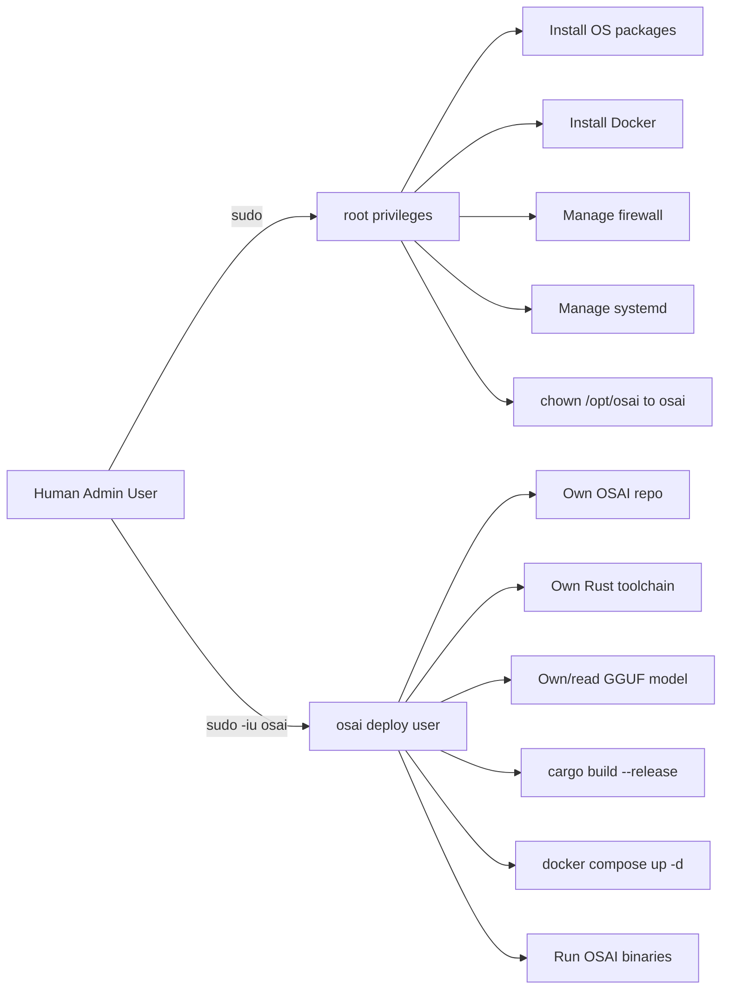
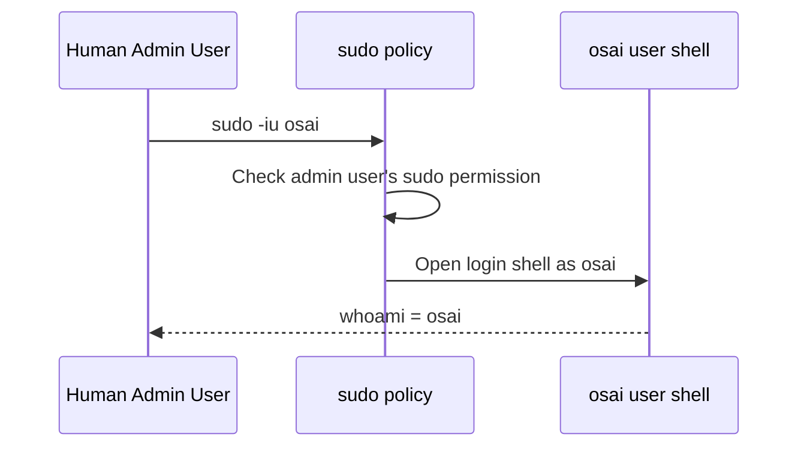
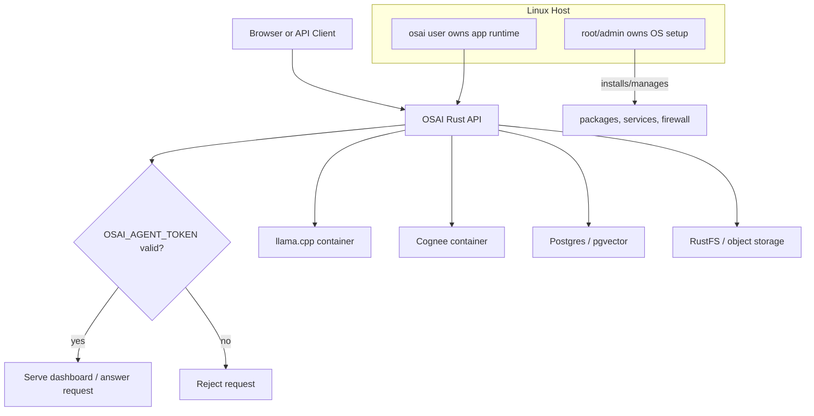
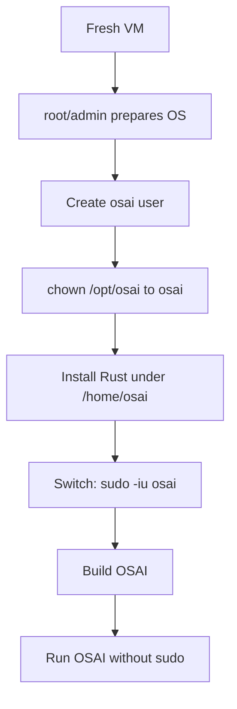

# OSAI Linux User Role Guide

> **Purpose:** explain why the OSAI setup uses a dedicated Linux user named `osai`, what `sudo -iu osai` means, how it is different from running directly as `root`, and how to use this model safely in a production-style server.

<div style="border-left: 5px solid #2563eb; padding: 12px 16px; background: #eff6ff; margin: 16px 0;">
  <strong>Core idea:</strong><br>
  Root prepares the machine. The <code>osai</code> user owns, builds, and runs the application.
</div>

---

## 1. What does `sudo -iu osai` mean?

```bash
sudo -iu osai
```

This command opens a login shell as the Linux user named `osai`.

Breakdown:

| Part | Meaning |
|---|---|
| `sudo` | Use your current admin user's sudo permission |
| `-i` | Start an interactive login shell for the target user |
| `-u osai` | Run as the `osai` user instead of root |

After running it, check:

```bash
whoami
pwd
```

Expected:

```text
osai
/home/osai
```

This means you are now working as the OSAI deploy user.

---

## 2. Why create a separate `osai` user?

A dedicated `osai` user gives the application its own stable identity on the server.

Instead of mixing everything under `root` or your personal SSH user, OSAI gets a separate operating-system-level owner:

```text
/home/osai
/opt/osai
/opt/osai/OS.rs
/opt/osai/OS.rs/osai-agent
/opt/osai/OS.rs/osai-agent/models
/opt/osai/OS.rs/osai-agent/target
```

This makes the system easier to manage, debug, secure, and automate.

---

## 3. Root vs admin user vs `osai` user

| User type | Purpose | Example commands |
|---|---|---|
| `root` | Full system administration | install packages, edit `/etc`, manage systemd/firewall |
| Your cloud/admin user | Human operator with sudo access | `sudo dnf install ...`, `sudo systemctl restart docker` |
| `osai` | Application deploy/runtime user | `cargo build --release`, `docker compose up -d`, run OSAI binaries |

<div style="border-left: 5px solid #dc2626; padding: 12px 16px; background: #fef2f2; margin: 16px 0;">
  <strong>Important:</strong><br>
  Do not run the OSAI app as <code>root</code> unless you are debugging a specific permission issue.
</div>

---

## 4. Why not run everything as root?

Running as root is simple, but it is risky.

Root can:

- modify almost any file on the server
- install/remove packages
- change firewall rules
- manage system services
- write to `/etc`, `/usr`, `/var`, `/root`
- override normal file permissions

If an app bug, bad script, exposed API, or compromised dependency runs as root, the blast radius is the whole machine.

Using `osai` reduces that blast radius.

```mermaid
flowchart TD
    A[Application Bug or Bad Command] --> B{Which user runs it?}

    B -->|root| C[Can affect entire OS]
    B -->|osai| D[Mostly limited to OSAI-owned files]

    C --> C1[/etc, systemd, firewall, packages, all app data]
    D --> D1[/opt/osai and /home/osai]
```

---

## 5. Principle of least privilege

The design follows a simple security rule:

> Give each user or process only the access it needs.

For OSAI:

```text
root/sudo user:
  prepare the operating system

osai user:
  own and run the application
```

The `osai` user does not need full root access to build Rust, read the model file, run application binaries, or run Docker Compose when Docker group access is configured.

---

## 6. OSAI user responsibility model



---

## 7. File ownership model

A clean OSAI install should look like this:

```text
/opt/osai/
└── OS.rs/
    └── osai-agent/
        ├── Cargo.toml
        ├── models/
        │   └── Qwen3-4B-Q4_K_M.gguf
        ├── target/
        │   └── release/
        └── docker-compose.storage.yml
```

Ownership should normally be:

```bash
sudo chown -R osai:osai /opt/osai
```

Then the `osai` user can work without sudo:

```bash
sudo -iu osai
cd /opt/osai/OS.rs/osai-agent
source ~/.cargo/env
cargo build --release
```

Diagram:

```mermaid
flowchart TD
    Root[root/admin] -->|creates| Opt[/opt/osai]
    Root -->|chown -R osai:osai| Opt

    Osai[osai user] -->|owns| Opt
    Opt --> Repo[OS.rs]
    Repo --> App[osai-agent]
    App --> Models[models/*.gguf]
    App --> Target[target/release]
    App --> Env[.env files]
```

---

## 8. Rust toolchain ownership

Rust should be installed under the `osai` user, not root.

Expected location:

```text
/home/osai/.cargo/bin/cargo
/home/osai/.cargo/bin/rustc
/home/osai/.rustup
```

Correct workflow:

```bash
sudo -iu osai
source ~/.cargo/env
cargo --version
rustc --version
```

Why this matters:

- Cargo build files are not root-owned.
- `target/` stays writable by `osai`.
- Rust path confusion is avoided.
- You do not need `sudo cargo`.

<div style="border-left: 5px solid #f59e0b; padding: 12px 16px; background: #fffbeb; margin: 16px 0;">
  <strong>Common mistake:</strong><br>
  Do not run <code>sudo cargo build</code> from inside the project. Build as <code>osai</code>.
</div>

---

## 9. Docker group note

The setup may add `osai` to the Docker group:

```bash
sudo usermod -aG docker osai
```

That allows:

```bash
docker ps
docker compose up -d
```

without `sudo`.

However, Docker group access is powerful because it can control the Docker daemon and containers. Treat `osai` as a trusted deploy user.

After adding a user to the Docker group, refresh the login session:

```bash
exit
sudo -iu osai
id
docker ps
```

Expected `id` output should include `docker`.

---

## 10. Correct command flow

### Step 1: system-level work as your admin user

```bash
sudo dnf install -y git curl jq
sudo systemctl restart docker
sudo mkdir -p /opt/osai
sudo chown -R osai:osai /opt/osai
```

### Step 2: app-level work as `osai`

```bash
sudo -iu osai
cd /opt/osai/OS.rs/osai-agent
source ~/.cargo/env
cargo check
cargo build --release
```

### Step 3: run OSAI as `osai`

```bash
export OSAI_AGENT_TOKEN="replace-with-a-long-random-token"
RUST_LOG=info ./target/release/osai-all
```

Do not run:

```bash
sudo ./target/release/osai-all
```

from inside the `osai` shell.

---

## 11. Why `osai` has no password

The `osai` user is a deploy/service user. It does not need direct password login.

You enter it using:

```bash
sudo -iu osai
```

from your normal admin user.

This means:

- your admin user proves permission through sudo
- the `osai` account does not need a password
- the app user is not a general human login account



---

## 12. What not to do

Avoid these patterns:

```bash
# Do not build as root
sudo cargo build --release

# Do not run the app as root
sudo ./target/release/osai-all

# Do not create model files as root if osai must read them
sudo curl -o models/Qwen3-4B-Q4_K_M.gguf ...

# Do not expect osai to have a sudo password
sudo -iu osai
sudo mkdir -p /some/root/path
```

Better:

```bash
# Admin user prepares ownership
sudo mkdir -p /opt/osai/OS.rs/osai-agent/models
sudo chown -R osai:osai /opt/osai

# osai user downloads/builds/runs
sudo -iu osai
cd /opt/osai/OS.rs/osai-agent
curl -fL -o models/Qwen3-4B-Q4_K_M.gguf "<model-url>"
cargo build --release
```

---

## 13. Troubleshooting table

| Problem | Cause | Fix |
|---|---|---|
| `sudo: a password is required` inside `osai` | `osai` is not a sudo admin user | Exit to your admin user and run sudo there |
| `sudo: cargo: command not found` | Rust installed under another user | Use `sudo -iu osai`, then `source ~/.cargo/env` |
| `Permission denied` writing model file | Directory not owned by current user | `sudo chown -R osai:osai /opt/osai` from admin user |
| Docker says permission denied | Group session not refreshed or user not in docker group | `exit`, `sudo -iu osai`, then check `id` |
| App asks for token | API/dashboard is exposed beyond localhost or requires auth | Set `OSAI_AGENT_TOKEN` |
| Docker container cannot see model | Host model path not mounted into container | Use `-v ./models:/models:ro` or Compose volume |

---

## 14. Runtime security model



---

## 15. Optional video and animation placeholders

GitHub Markdown can display GIFs directly:

```md

```

If your renderer supports HTML video tags, you can embed a local MP4:

```html
<video controls width="800">
  <source src="assets/osai-user-role-flow.mp4" type="video/mp4">
  Your browser does not support the video tag.
</video>
```

Recommended animation idea:

```text
Frame 1: Admin user logs into VM
Frame 2: Admin runs sudo to prepare /opt/osai
Frame 3: Admin switches with sudo -iu osai
Frame 4: osai builds Rust and runs app
Frame 5: App runs without root privileges
```

---

## 16. Practical mental model



Short version:

> Root is for the machine.  
> `osai` is for the application.

---

## 17. References

- Linux `useradd` manual: https://man7.org/linux/man-pages/man8/useradd.8.html
- Docker post-installation notes and Docker group warning: https://docs.docker.com/engine/install/linux-postinstall/
- Rustup installation paths: https://rust-lang.github.io/rustup/installation/index.html
- Red Hat Linux file permissions overview: https://www.redhat.com/en/blog/linux-file-permissions-explained
