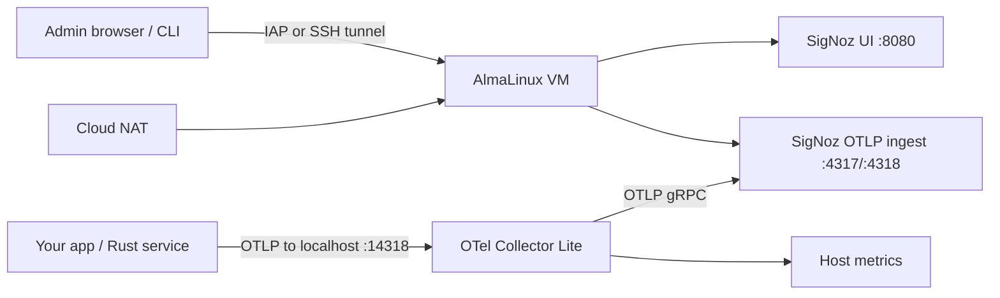
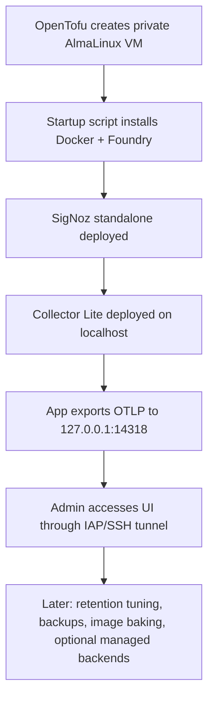

# Lightweight SigNoz and OpenTelemetry on AlmaLinux with OpenTofu

## Executive summary

For a fresh AlmaLinux VM on Google Cloud, the most practical lightweight path is a **single private VM** provisioned with **OpenTofu**, running **Docker Engine + Docker Compose v2**, deploying **SigNoz in standalone Docker mode** using the current **Foundry** workflow, and optionally running a **small local OpenTelemetry Collector agent** bound only to `127.0.0.1` for host metrics and app telemetry fan-in. SigNoz’s current self-hosted Docker guidance is explicitly oriented to a **single machine**, requires **Docker Engine 20.10+ with the Compose v2 plugin**, needs **at least 4 GB of memory allocated to Docker**, and exposes **8080** for the UI plus **4317/4318** for OTLP ingestion. citeturn3view0turn24view0

On GCP, the clean production-leaning baseline is: **private IP only**, **Cloud NAT enabled for outbound package/artifact downloads**, **OS Login enabled**, **IAP for SSH/tunneling**, and **no public firewall rule for 8080/4317/4318** unless you have a real reason to expose them. Cloud NAT is designed for outbound connectivity from VMs without external IPs and does **not** permit unsolicited inbound access. IAP TCP forwarding requires the IAP source range and the `roles/iap.tunnelResourceAccessor` role, while OS Login access is controlled by `roles/compute.osLogin` or `roles/compute.osAdminLogin`. citeturn4view1turn15view3turn14view5turn10view1

Your uploaded architecture note points to a stack centered on **Rust, Docker Compose, an OpenTelemetry Collector, and SigNoz**, with observability focused on **traces, metrics, logs, and AI workflow spans**. That makes it likely that `signoz-opentelemetry.zip` contains not just infra manifests, but also app instrumentation, OTel config, compose files, and operational docs that should be prioritized first. fileciteturn0file0

## Assumptions and likely zip inventory

The exact contents of `signoz-opentelemetry.zip` are unspecified, so the inventory below is a **best-effort operator triage map** based on current SigNoz self-host patterns, OpenTelemetry Collector conventions, and the architecture style in your uploaded note. Current SigNoz self-host installs are generated into a `pours/` directory by Foundry and should not be treated as hand-edited source; SigNoz recommends using the declarative config and patches rather than editing generated deployment files directly. citeturn3view0turn24view0

### Likely contents to prioritize first

| Likely path or file | Why it matters first | What to look for |
|---|---|---|
| `README.md` | Establishes intended deployment flow, ports, env vars, and prerequisites | Whether repo expects Foundry, raw Docker Compose, or custom scripts |
| `DEPLOYMENT.md` | Usually contains VM assumptions, public/private access model, and rollout order | GCP-specific steps, startup script usage, required IAM |
| `IAM_BOOTSTRAP.md` | Critical if a new user needs to create VMs/firewalls | Required roles, who grants them, IAP and OS Login usage |
| `infra/*.tf`, `opentofu/*.tf`, or root `*.tf` | OpenTofu entrypoint for VM/network/firewall/NAT | VM resource, tags, metadata/startup script, service accounts |
| `scripts/startup.sh` or `cloud-init.yaml` | First-boot dependency installation and deployment automation | Docker install, repo clone, Signoz install, firewalld, systemd |
| `casting.yaml` | Current SigNoz declarative install source if using Foundry | `flavor: compose`, version pinning, patches |
| `docker-compose.yml`, `compose.yaml`, `docker-compose.signoz.yml` | Needed only if repo bypasses Foundry or adds custom components | UI, collector, data volumes, resource limits |
| `otel/collector.yaml` or `otel-collector/config.yaml` | The most important OpenTelemetry file after infra | OTLP receivers, hostmetrics, processors, exporters |
| `Cargo.toml` and `src/` | Tells you whether Rust toolchain is actually required on the VM | If present, decide whether to build on boot or ship binaries |
| `.env.example` or `env/*.env` | Required runtime endpoints and secrets | OTLP endpoint, service name, Signoz URL, auth headers |
| `dashboards/` or `alerts/` | Nice to have after the base stack works | Default dashboards, latency/error alerts |
| `runbooks/`, `knowledge/`, `docs/` | Useful operational context and AI-agent context | Host scan logic, telemetry naming, incident summaries |

The fastest safe way to assess the zip before changing anything is:

```bash
unzip -l signoz-opentelemetry.zip | less
mkdir -p /tmp/signoz-opentelemetry && unzip signoz-opentelemetry.zip -d /tmp/signoz-opentelemetry
cd /tmp/signoz-opentelemetry
find . -maxdepth 3 | sort
```

### Variables that remain open

| Variable | Example | Why it stays variable |
|---|---|---|
| `project_id` | `my-observability-project` | Project already exists, but not specified |
| `region` | `us-central1` | Needed for subnet/NAT/resources |
| `zone` | `us-central1-a` | Needed for VM placement and SSH/IAP commands |
| `vm_name` | `signoz-alma-vm` | Naming convention is your choice |
| `machine_type` | `e2-standard-2` | Depends on expected telemetry load |
| `subnet` | `observability-subnet` | Existing or new VPC/subnet is unknown |
| `enable_public_ip` | `false` | Should be policy-driven |
| `allowed_admin_cidrs` | `["203.0.113.10/32"]` | Only needed if UI is intentionally public |
| `signoz_version` | `pinned` | Pinning recommended; exact version is your release choice |
| `repo_url` | `git@github.com:org/repo.git` | Only relevant if startup clones code |
| `install_rust` | `true/false` | Only needed if the repo builds Rust on-VM |

## Target environment, sizing, and IAM

### Minimal VM sizing that is actually practical

SigNoz’s current Docker standalone docs require **at least 4 GB allocated to Docker** and describe the deployment as a **single-machine** setup. In practice, on a VM, that means a 4 GB instance is only appropriate for very small demos because the OS, Docker daemon, ClickHouse, Postgres, the SigNoz UI, and any local collector still need headroom. A **2 vCPU / 8 GB RAM / 50 GB balanced disk** VM is the minimum I would recommend for a stable “lightweight but usable” setup; move to **4 vCPU / 16 GB** if you plan to co-host your app or keep more retention. This is an operator recommendation inferred from SigNoz’s documented Docker memory floor and retention defaults. citeturn24view0turn24view1

| Profile | vCPU | RAM | Disk | Network stance | Recommended use |
|---|---:|---:|---:|---|---|
| Tiny proof-of-concept | 2 | 4 GB | 30–50 GB | Private IP + Cloud NAT | Only for a short-lived demo with low ingest |
| Practical lightweight baseline | 2 | 8 GB | 50 GB pd-balanced | Private IP + Cloud NAT | Best default for a fast, small, stable stack |
| Co-hosted app + observability | 4 | 16 GB | 100 GB pd-balanced | Private IP + Cloud NAT | If app, collector, and SigNoz share the VM |
| Public UI edge case | 2+ | 8+ GB | 50+ GB | Public IP optional, but still prefer private + proxy | Only if UI must be internet-reachable |

### Public IP versus private IP

A private-only VM with Cloud NAT is the best default. Cloud NAT exists specifically to give VMs **without external IPv4 addresses** outbound internet access and explicitly **does not** allow unsolicited inbound connections. That matches your need to install Docker, Rust, and dependencies at first boot without exposing SSH or the SigNoz UI to the internet. If operators need browser access, use **IAP/SSH tunneling** to `localhost:8080` first; only consider public exposure later, and only for the UI port, never for OTLP ingestion ports unless you have authenticating ingress in front of them. citeturn4view1turn15view3turn15view2

### IAM roles the new user actually needs

Your earlier GCP permission errors map directly to IAM, not Linux `sudo`. To create and manage VMs that use a service account, Google documents that `roles/compute.instanceAdmin.v1` must be paired with `roles/iam.serviceAccountUser`; for broader full-control compute administration, `roles/compute.admin` also requires `roles/iam.serviceAccountUser` when service accounts are involved. Firewall creation and modification requires `roles/compute.securityAdmin`. SSH access with OS Login uses `roles/compute.osLogin` or `roles/compute.osAdminLogin`, and IAP TCP forwarding uses `roles/iap.tunnelResourceAccessor`. citeturn9view1turn9view0turn10view0turn9view2turn14view5turn10view1

| Persona | Role | Why |
|---|---|---|
| VM deployer | `roles/compute.instanceAdmin.v1` | Create/modify/delete VM instances and related disks/images citeturn9view1 |
| VM deployer using service accounts | `roles/iam.serviceAccountUser` on the specific VM service account | Required to attach/use a service account on a VM citeturn9view1turn10view0 |
| Simple one-person lab operator | `roles/compute.admin` + `roles/iam.serviceAccountUser` | Broad Compute control with service-account attachment ability citeturn9view0turn10view0 |
| Firewall/network security operator | `roles/compute.securityAdmin` | Create/modify/delete firewall rules and related security resources citeturn9view2 |
| SSH admin | `roles/compute.osAdminLogin` | OS Login with `sudo` access citeturn14view5turn9view3 |
| SSH standard user | `roles/compute.osLogin` | OS Login without `sudo` citeturn14view5turn9view3 |
| IAP tunnel user | `roles/iap.tunnelResourceAccessor` | Required to use IAP TCP forwarding to the VM citeturn10view1turn15view3 |

For the **VM runtime service account**, the best default is **no broad project roles at all** unless the VM must read from GCS, Artifact Registry, or Google Observability APIs. Compute Engine instances can access the metadata server **without additional authorization**, so startup scripts can safely fetch instance metadata without extra IAM. If you decide to store your startup script in a GCS bucket and reference it by `startup-script-url`, then the VM service account needs `Storage Object Viewer` on that bucket. citeturn25view1turn14view2

## OpenTofu-driven implementation plan

### Reference architecture



This shape keeps the UI and OTLP endpoints off the public internet by default while preserving simple single-node deployment. The choice is aligned with SigNoz’s supported single-machine Docker path and OpenTelemetry’s recommendation to prefer `localhost` binding when all clients are local. citeturn24view2turn11view0

### OpenTofu plan

Use OpenTofu to create the **VM**, **optional subnet**, **Cloud Router + NAT**, **IAP SSH firewall**, and an **optional admin-only UI firewall rule**. Prefer normal expression references over `depends_on`; OpenTofu explicitly recommends `depends_on` only for hidden dependencies that it cannot infer automatically. citeturn21view0

A practical repo structure is:

```text
infra/
  providers.tf
  variables.tf
  main.tf
  outputs.tf
  scripts/
    startup.sh
config/
  casting.yaml
  otel-collector-lite.yaml
  otel-lite-compose.yaml
docs/
  README.md
  DEPLOYMENT.md
  IAM_BOOTSTRAP.md
```

A representative OpenTofu skeleton looks like this:

```hcl
terraform {
  required_version = ">= 1.6.0"
  required_providers {
    google = {
      source  = "hashicorp/google"
      version = "~> 6.0"
    }
  }
}

provider "google" {
  project = var.project_id
  region  = var.region
  zone    = var.zone
}

resource "google_service_account" "vm" {
  account_id   = "${var.vm_name}-sa"
  display_name = "SigNoz VM runtime SA"
}

resource "google_compute_router" "nat" {
  count   = var.enable_public_ip ? 0 : 1
  name    = "${var.vm_name}-router"
  network = var.network
  region  = var.region
}

resource "google_compute_router_nat" "nat" {
  count                              = var.enable_public_ip ? 0 : 1
  name                               = "${var.vm_name}-nat"
  router                             = google_compute_router.nat[0].name
  region                             = var.region
  nat_ip_allocate_option             = "AUTO_ONLY"
  source_subnetwork_ip_ranges_to_nat = "ALL_SUBNETWORKS_ALL_IP_RANGES"
}

resource "google_compute_firewall" "iap_ssh" {
  name    = "${var.vm_name}-allow-ssh-from-iap"
  network = var.network

  direction     = "INGRESS"
  source_ranges = ["35.235.240.0/20"]
  allow {
    protocol = "tcp"
    ports    = ["22"]
  }

  target_tags = ["signoz-admin"]
}

resource "google_compute_firewall" "signoz_ui" {
  count   = var.public_signoz_ui ? 1 : 0
  name    = "${var.vm_name}-allow-signoz-ui"
  network = var.network

  direction     = "INGRESS"
  source_ranges = var.allowed_admin_cidrs
  allow {
    protocol = "tcp"
    ports    = ["8080"]
  }

  target_tags = ["signoz-ui"]
}

resource "google_compute_instance" "vm" {
  name         = var.vm_name
  machine_type = var.machine_type
  zone         = var.zone
  tags         = ["signoz-admin", "signoz-ui"]

  boot_disk {
    initialize_params {
      image = var.image
      size  = var.boot_disk_gb
      type  = "pd-balanced"
    }
  }

  metadata = {
    enable-oslogin = "TRUE"
    startup-script = file("${path.module}/scripts/startup.sh")
  }

  network_interface {
    subnetwork = var.subnetwork
    dynamic "access_config" {
      for_each = var.enable_public_ip ? [1] : []
      content {}
    }
  }

  service_account {
    email  = google_service_account.vm.email
    scopes = ["https://www.googleapis.com/auth/cloud-platform"]
  }
}
```

The OS Login metadata key/value shown above is directly documented by Compute Engine, including Terraform examples. Startup scripts are also officially supported through the `startup-script` metadata key, which runs on boot. citeturn30view1turn14view1

### Startup script for AlmaLinux

The current supported SigNoz self-host path is Foundry-backed Docker deployment, not the old legacy bundled compose/install script flow. On AlmaLinux, the least-friction boot path is therefore: update system, install Docker Engine and Compose plugin from Docker’s CentOS repo, optionally install Rust if the repo contains a Rust app, install `foundryctl`, cast SigNoz, then stand up a tiny supplemental collector only if needed. Docker’s CentOS install docs map cleanly to AlmaLinux for this purpose. citeturn3view0turn12view2turn12view1turn13view0

```bash
#!/usr/bin/env bash
set -Eeuo pipefail

exec > >(tee -a /var/log/startup-signoz.log) 2>&1

echo "[+] Updating AlmaLinux"
dnf -y update
dnf -y install epel-release || true
dnf -y install dnf-plugins-core curl git tar unzip jq ca-certificates firewalld

echo "[+] Enabling firewalld"
systemctl enable --now firewalld

echo "[+] Applying conservative sysctl tuning"
cat >/etc/sysctl.d/99-signoz-lite.conf <<'EOF'
vm.swappiness = 1
net.core.somaxconn = 1024
fs.inotify.max_user_watches = 524288
EOF
sysctl --system || true

echo "[+] Installing Docker Engine + Compose v2"
dnf config-manager --add-repo https://download.docker.com/linux/centos/docker-ce.repo
dnf -y install docker-ce docker-ce-cli containerd.io docker-buildx-plugin docker-compose-plugin
systemctl enable --now docker

echo "[+] Preparing directories"
install -d -m 0755 /opt/signoz /opt/otel /opt/app

echo "[+] Optional Rust install"
if [[ "${INSTALL_RUST:-false}" == "true" ]]; then
  curl --proto '=https' --tlsv1.2 -sSf https://sh.rustup.rs | sh -s -- -y
  cat >/etc/profile.d/rust.sh <<'EOF'
source "$HOME/.cargo/env" 2>/dev/null || true
EOF
fi

echo "[+] Installing foundryctl"
curl -fsSL https://signoz.io/foundry.sh | bash
if [[ -x /root/.foundry/bin/foundryctl ]]; then
  ln -sf /root/.foundry/bin/foundryctl /usr/local/bin/foundryctl
fi
export PATH="/usr/local/bin:/root/.foundry/bin:${PATH}"

echo "[+] Writing SigNoz casting.yaml"
cat >/opt/signoz/casting.yaml <<'EOF'
apiVersion: v1alpha1
kind: Installation
metadata:
  name: signoz
spec:
  deployment:
    flavor: compose
    mode: docker
EOF

echo "[+] Deploying SigNoz"
cd /opt/signoz
foundryctl gauge -f casting.yaml
foundryctl cast -f casting.yaml

echo "[+] Writing lightweight OTel Collector config"
cat >/opt/otel/config.yaml <<'EOF'
receivers:
  otlp:
    protocols:
      grpc:
        endpoint: 127.0.0.1:14317
      http:
        endpoint: 127.0.0.1:14318
  hostmetrics:
    root_path: /hostfs
    collection_interval: 30s
    scrapers:
      cpu: {}
      memory: {}
      disk: {}
      filesystem: {}
      load: {}
      network: {}

processors:
  batch: {}

exporters:
  otlp:
    endpoint: 127.0.0.1:4317
    tls:
      insecure: true

extensions:
  health_check:
    endpoint: 127.0.0.1:13133

service:
  extensions: [health_check]
  pipelines:
    traces:
      receivers: [otlp]
      processors: [batch]
      exporters: [otlp]
    metrics:
      receivers: [otlp, hostmetrics]
      processors: [batch]
      exporters: [otlp]
    logs:
      receivers: [otlp]
      processors: [batch]
      exporters: [otlp]
EOF

echo "[+] Writing collector compose file"
cat >/opt/otel/compose.yaml <<'EOF'
services:
  otel-lite:
    image: otel/opentelemetry-collector-contrib:latest
    network_mode: host
    command: ["--config=/etc/otelcol/config.yaml"]
    volumes:
      - /opt/otel/config.yaml:/etc/otelcol/config.yaml:ro
      - /:/hostfs:ro
    restart: unless-stopped
EOF

echo "[+] Starting collector"
docker compose -f /opt/otel/compose.yaml up -d

echo "[+] Enabling local-only firewalld posture"
firewall-cmd --permanent --add-service=ssh || true
firewall-cmd --reload || true

echo "[+] Done"
```

This script follows current official installation patterns for Docker and SigNoz, and uses a local collector shape that matches OpenTelemetry Collector’s configuration structure. The collector config intentionally binds to `127.0.0.1`; OpenTelemetry’s docs note that `0.0.0.0` is often shown only for convenience and that `localhost` is preferable when clients are local. citeturn12view2turn12view1turn3view0turn11view0

### Systemd units

Use simple **oneshot wrappers** around Docker Compose so the host can re-assert desired state on boot without forcing you to manage every container manually.

```ini
# /etc/systemd/system/signoz-stack.service
[Unit]
Description=SigNoz stack
Requires=docker.service
After=docker.service network-online.target
Wants=network-online.target

[Service]
Type=oneshot
RemainAfterExit=yes
WorkingDirectory=/opt/signoz/pours/deployment
ExecStart=/usr/bin/docker compose up -d
ExecStop=/usr/bin/docker compose down
TimeoutStartSec=0

[Install]
WantedBy=multi-user.target
```

```ini
# /etc/systemd/system/otel-lite.service
[Unit]
Description=OTel Collector Lite
Requires=docker.service
After=docker.service network-online.target
Wants=network-online.target

[Service]
Type=oneshot
RemainAfterExit=yes
WorkingDirectory=/opt/otel
ExecStart=/usr/bin/docker compose -f /opt/otel/compose.yaml up -d
ExecStop=/usr/bin/docker compose -f /opt/otel/compose.yaml down
TimeoutStartSec=0

[Install]
WantedBy=multi-user.target
```

Then enable them:

```bash
sudo systemctl daemon-reload
sudo systemctl enable --now signoz-stack.service otel-lite.service
```

### Application OTLP settings

For a local app on the VM, point OTLP to the local collector rather than directly to SigNoz. The standard OTLP exporter environment variables are `OTEL_EXPORTER_OTLP_ENDPOINT` and `OTEL_EXPORTER_OTLP_PROTOCOL`; the documented defaults are `localhost:4317` for gRPC and `localhost:4318` for HTTP, so using alternate local ports such as `14317/14318` is a clean way to avoid conflicting with the SigNoz ingester’s host ports. citeturn20view0turn20view2turn20view3

```bash
export OTEL_SERVICE_NAME=my-service
export OTEL_EXPORTER_OTLP_PROTOCOL=http/protobuf
export OTEL_EXPORTER_OTLP_ENDPOINT=http://127.0.0.1:14318
```

If your zip contains `Cargo.toml`, install Rust with `rustup`; the Rust project recommends `curl ... | sh` via rustup and notes that Rust tools end up in `~/.cargo/bin`. citeturn13view0

## Network, security, and lightweight optimization

### Bind addresses and firewall posture

OpenTelemetry’s Collector docs explicitly warn that their examples often bind to the unspecified address for convenience and that the Collector defaults to `localhost`; for a single-VM setup, that supports the design choice to bind your collector’s OTLP receivers and health endpoint only to `127.0.0.1`. For GCP firewalling, Google recommends least privilege: block by default and allow only specific protocols, ports, and sources. VPC firewall rules are stateful and apply per instance. citeturn11view0turn15view2turn15view0

That yields the following operating model:

| Port | Bind | Public? | Purpose |
|---|---|---|---|
| `22` | normal SSH | No, except from IAP range | Admin access |
| `8080` | host-published by SigNoz | Usually no | UI |
| `4317` / `4318` | host-published by SigNoz | No | Internal OTLP ingestion |
| `14317` / `14318` | `127.0.0.1` only | No | Local collector ingress |
| `13133` | `127.0.0.1` only | No | Collector health check |

If you use IAP, create only the documented ingress rule from `35.235.240.0/20` to port `22`, and remove broad `0.0.0.0/0` SSH rules like `default-allow-ssh` if they exist. Google’s IAP TCP forwarding docs show exactly this source range and explicitly note that default SSH/RDP rules are broader than necessary. citeturn15view3

### IAP and SSH tunnel access

For the admin workflow, prefer tunnels instead of public UI exposure:

```bash
gcloud compute ssh VM_NAME --zone ZONE -- -L 8080:127.0.0.1:8080
```

Then open:

```text
http://localhost:8080
```

If you want to allow port-restricted IAP access conditions, Google documents using a CEL condition such as `destination.port == 22`. citeturn15view4turn10view1

### TLS and ingress suggestions

SigNoz’s standalone Docker install exposes the UI as plain HTTP on port `8080`. For an actual public-facing deployment, front it with a reverse proxy or load balancer that terminates TLS and adds authentication, or keep it entirely private and use IAP/SSH tunnels. If the UI does become public, do **not** expose `4317` or `4318` directly to the internet unless you have a deliberate authenticated ingestion model in front of them. SigNoz’s documented open ports make this separation clear. citeturn24view0

### Lightweight optimizations that matter most

The fastest way to keep the stack small is to **not collect everything on day one**. Start with app traces/metrics/logs plus host metrics; add Docker socket–backed container stats and file tailing only after the base system is healthy. The Host Metrics receiver is intended for collector-as-agent deployment, while the Docker Stats receiver requires socket access and the OTel contrib docs call out both the permission issue and the security trade-off. citeturn16view0turn17view1turn17view2

The concrete optimizations I recommend are these:

| Optimization | Why it helps | Notes |
|---|---|---|
| Keep the collector “lite” at first | Lowers CPU/RAM and operational complexity | Start with `hostmetrics` + `otlp` only |
| Delay `dockerstats` | Avoids Docker socket privileges | Enable later only if container-level metrics are worth the risk citeturn17view1turn17view2 |
| Delay `filelog` | Reduces I/O and parser complexity | Add only after log retention/search needs are clear |
| Lower retention aggressively on small VMs | ClickHouse storage drops quickly when retention drops | SigNoz defaults are 7 days logs/traces and 30 days metrics; shorten for dev labs citeturn24view1 |
| Pin image versions | Avoids surprise upgrades | SigNoz documents image pinning in `casting.yaml` customization citeturn3view0 |
| Use Foundry patches instead of hand-editing generated files | Keeps deployments reproducible | Generated files under `pours/` are overwritten by `forge`/`cast` citeturn3view0turn24view0 |
| Keep MCP disabled unless needed | Saves one service and one port | SigNoz MCP is optional and disabled by default citeturn3view0 |

For backups, remember that the documented standalone SigNoz stack includes **ClickHouse**, **Postgres**, the **SigNoz UI**, and the **SigNoz OTel collector/ingester**. That means your backup boundary is the stateful storage behind ClickHouse and Postgres first, not just the UI container. Persistent disk snapshots at the VM level are acceptable for a small stack; for cleaner restores later, split data volumes once the system stabilizes. citeturn3view0

If you later enable `filelog`, use a storage extension so offsets survive collector restarts; the filelog receiver explicitly documents that without storage, offsets are only kept in memory. citeturn17view3

## CI, packaging, and ready-to-add repository docs

### Artifact and CI/CD plan

For a production-friendlier zip artifact, package only the **source of truth** and exclude generated state and caches. That means: include `infra/`, `scripts/`, `config/`, `docs/`, and optionally a prebuilt app binary if you decide to stop compiling on-VM. Exclude `.terraform/`, `*.tfstate*`, `pours/`, `.git/`, `target/`, and local `.env` files. SigNoz’s docs are explicit that `pours/` is generated output and should not be your canonical editable deployment state. citeturn3view0

A lightweight CI pipeline should do this:

```text
tofu fmt -check
tofu validate
bash -n scripts/startup.sh
docker compose -f config/otel-lite-compose.yaml config
yamllint config/*.yaml docs/*.md
shellcheck scripts/startup.sh
zip -r signoz-opentelemetry-production.zip infra scripts config docs \
  -x '*.tfstate*' -x '.terraform/*' -x 'pours/*' -x '.git/*' -x 'target/*'
```

As the stack matures, move from boot-time package installation to a **pre-baked image** so VM startup is faster and more reproducible. Startup scripts remain useful for final configuration and small diffs, but image baking is the better long-term production move.

### Sample `README.md`

```md
# signoz-opentelemetry

Single-VM SigNoz + OpenTelemetry deployment for AlmaLinux on Google Cloud using OpenTofu.

## What this repo creates

- One AlmaLinux VM
- Optional Cloud NAT for outbound package access without a public IP
- IAP-compatible SSH access
- SigNoz standalone on Docker
- Optional local OpenTelemetry Collector Lite

## Default access model

- Private VM
- OS Login enabled
- IAP / SSH tunnel for admin access
- No public access to OTLP ingestion ports

## Quick start

```bash
cd infra
tofu init
tofu plan -var-file=dev.tfvars
tofu apply -var-file=dev.tfvars
```

## UI access

```bash
gcloud compute ssh VM_NAME --zone ZONE -- -L 8080:127.0.0.1:8080
```

Then open `http://localhost:8080`.

## App telemetry

Point local apps to:

```bash
export OTEL_SERVICE_NAME=my-service
export OTEL_EXPORTER_OTLP_PROTOCOL=http/protobuf
export OTEL_EXPORTER_OTLP_ENDPOINT=http://127.0.0.1:14318
```
```

The port choices and standalone deployment shape in this sample align with current SigNoz and OTLP documentation. citeturn24view0turn20view3

### Sample `DEPLOYMENT.md`

```md
# Deployment

## Goal

Deploy a lightweight single-node SigNoz + OpenTelemetry stack on AlmaLinux.

## Recommended defaults

- Private IP only
- Cloud NAT enabled
- OS Login enabled
- IAP SSH/tunnel access
- SigNoz UI not exposed publicly
- OTLP ingestion not exposed publicly

## Deployment flow

1. OpenTofu creates VM, firewall, and optional NAT.
2. Startup script installs Docker and Foundry.
3. Startup script deploys SigNoz standalone.
4. Startup script deploys a local OTel Collector Lite.
5. Operator verifies ports and health.
6. Application exports OTLP to localhost.

## Post-deploy checks

```bash
sudo ss -lntp | egrep '8080|4317|4318|14317|14318|13133'
sudo docker ps
sudo journalctl -u signoz-stack -u otel-lite -n 200 --no-pager
curl -sf http://127.0.0.1:8080/ >/dev/null && echo OK
```
```

### Sample `IAM_BOOTSTRAP.md`

```md
# IAM bootstrap

## Who grants access

A project owner or existing administrator must grant the initial roles.

## Minimum roles for a VM deployer

- roles/compute.instanceAdmin.v1
- roles/iam.serviceAccountUser on the VM service account
- roles/compute.securityAdmin if the user must create firewall rules
- roles/compute.osAdminLogin for sudo SSH with OS Login
- roles/iap.tunnelResourceAccessor for IAP TCP forwarding

## Why Linux sudo is not enough

Google Cloud firewall rules, VM creation, and IAM are controlled by Google Cloud IAM, not by the Linux user inside the VM.

## Recommended operating model

- Use OS Login instead of metadata SSH keys
- Use IAP for admin access
- Keep the VM private
- Open public UI access only when explicitly required
```

## Verification, troubleshooting, and add-ons

### Manual verification checklist

A first successful deployment should verify all of the following:

| Check | Command | Expected result |
|---|---|---|
| Docker is up | `sudo systemctl status docker` | `active (running)` |
| SigNoz containers exist | `sudo docker ps` | ClickHouse, Postgres, SigNoz UI, ingester visible |
| Key ports are listening | `sudo ss -lntp | egrep '8080|4317|4318|14317|14318|13133'` | Listeners present |
| Collector health | `curl -sf http://127.0.0.1:13133` | Health response |
| UI health | `curl -I http://127.0.0.1:8080` | HTTP response |
| OS Login metadata set | `curl -H "Metadata-Flavor: Google" http://metadata.google.internal/computeMetadata/v1/instance/attributes/enable-oslogin` | `TRUE` |
| VM identity metadata works | `curl -H "Metadata-Flavor: Google" http://metadata.google.internal/computeMetadata/v1/instance/name` | VM name |
| Zone lookup works | `curl -H "Metadata-Flavor: Google" http://metadata.google.internal/computeMetadata/v1/instance/zone` | Project/zone path |

Compute Engine documents the metadata server as available inside the VM without additional authorization, which is why these checks are valuable even when your `gcloud` user lacks project permissions. citeturn25view1turn14view1

### Troubleshooting commands that matter

Use these in this order:

```bash
sudo ss -lntp
sudo docker ps
sudo docker compose -f /opt/signoz/pours/deployment/compose.yaml ps
sudo docker compose -f /opt/signoz/pours/deployment/compose.yaml logs -f signoz-signoz-0
sudo docker compose -f /opt/otel/compose.yaml logs -f
sudo journalctl -u docker -u signoz-stack -u otel-lite -n 200 --no-pager
sudo firewall-cmd --list-all
```

SigNoz’s current docs explicitly recommend checking logs from the generated Compose file in `pours/deployment/compose.yaml` when the UI fails or containers become unhealthy. citeturn3view0turn24view0

Common failure patterns are:

- **Nothing on `8080`**: `foundryctl cast` failed or containers restarted because of insufficient RAM. SigNoz explicitly calls out memory shortage as a restart cause and requires at least 4 GB allocated to Docker. citeturn24view0
- **Permission denied on Docker socket**: collector or user is missing Docker socket access. The Docker Stats receiver docs explain that the socket is normally accessible only to `root` or the `docker` group. citeturn17view1turn17view2
- **Can SSH but not use IAP**: missing `roles/iap.tunnelResourceAccessor` or missing firewall ingress from `35.235.240.0/20`. citeturn10view1turn15view3
- **Startup script references GCS and fails**: VM service account is missing `Storage Object Viewer` on the bucket. citeturn14view2

### Add-ons and alternatives worth considering

If you want to keep the self-hosted control plane but offload some concerns, there are three strong alternatives:

| Option | Best for | Trade-off |
|---|---|---|
| Prometheus `remote_write` | Long-term metric forwarding to another backend | Adds another destination and tuning surface; Prometheus supports `remote_write` natively in config citeturn27view0 |
| Grafana Cloud OTLP endpoint | Fastest managed OTLP landing zone for dev/test | Less self-hosted control, recurring cost, but official OTLP support is straightforward citeturn27view4 |
| Google Cloud Trace + Managed Service for Prometheus + Ops Agent | GCP-native ops teams who want fewer self-hosted moving parts | More split-brain than SigNoz’s unified UI, but Google explicitly supports OTel-based ingest and host telemetry collection citeturn27view2turn28view0turn27view3 |

The most relevant trade-offs are:

- **Stay with SigNoz** if you want one self-hosted place for traces, metrics, and logs on a single node with a low initial footprint.
- **Use Grafana Cloud OTLP** if you want to stop running ClickHouse/Postgres yourself and just send OTLP.
- **Use Google-native observability** if the organization already standardizes on Cloud Monitoring/Trace and prefers fewer self-managed components; Cloud Trace explicitly recommends the Telemetry API for compatibility with the OpenTelemetry ecosystem, and the Ops Agent already combines logs, metrics, and traces using Fluent Bit plus the OpenTelemetry Collector. citeturn27view2turn27view3

A sensible evolution path is:



The overall recommendation is simple: **start private, start small, bind locally, collect only what you need, and let OpenTofu own the VM/NAT/firewall story while Foundry owns the SigNoz deployment story**. That gives you the fastest path to a lightweight and operator-friendly AlmaLinux deployment while staying aligned with current official docs. citeturn3view0turn12view2turn4view1turn30view1turn21view0