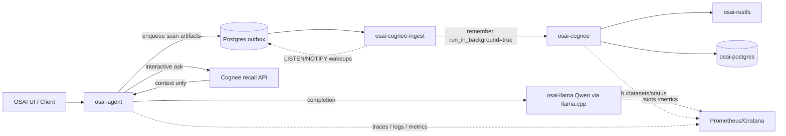
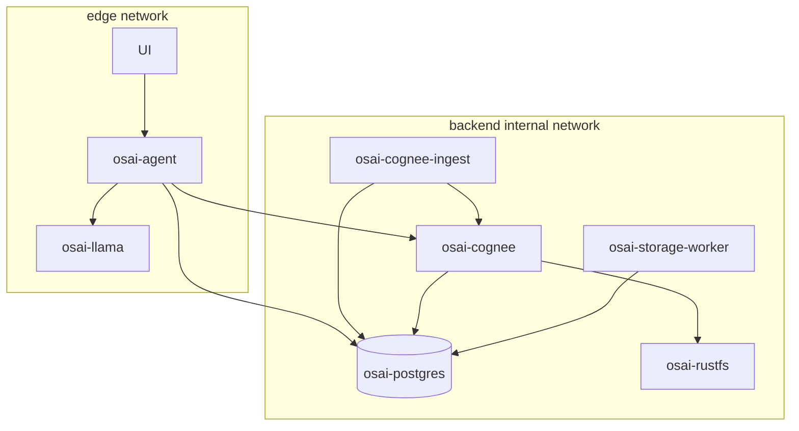

# Making OSAI, Cognee, and Qwen Efficient, Robust, and Production-Ready

## Executive summary

The highest-leverage change for your stack is to **separate the user-facing ask path from the graph-building ingest path**. In your current setup, `osai-cognee-ingest` appears to call Cognee’s `remember` endpoint in its default blocking mode, and Cognee documents that this mode waits until the knowledge graph is fully built and “can take minutes for large files.” Cognee also supports `run_in_background=true`, in which case the request returns immediately and you poll dataset status separately. Your pasted logs line up with this exact failure mode: `osai-cognee-ingest` waited for a long time and then timed out on `POST /api/v1/remember`, while the UI remained stuck on “Recalling Cognee memory and asking local Qwen…”. citeturn12view0turn32view0 fileciteturn0file0

The second highest-leverage change is to **run CPU-only Qwen conservatively**. llama.cpp exposes server slots through `--parallel`, per-slot context through `--ctx-size`, prompt caching through `--cache-prompt`, and monitoring via `/slots` and `/metrics`. Your logs show that the model loaded successfully, but also show very slow prompt processing, concurrent slot activity, and at least one request truncated because the prompt exceeded the configured 2048-token slot context. On a machine with 8–16 GB RAM and no GPU, that is a strong signal to start with **`parallel=1`**, a moderate context size, short recall payloads, and a hard rule that ingestion never competes with interactive answering on the same model instance. citeturn27view0turn13view1turn13view2turn13view3 fileciteturn0file1

The third major change is to make your Rust services **backpressure-aware and event-driven**. Tokio’s bounded `mpsc` channels provide backpressure, `Semaphore` gives fair concurrency control, `spawn_blocking` should be tightly limited for CPU-bound or long-running work, and SQL connection pools should have explicit max/min/acquire timeouts. For the outbox path, PostgreSQL’s `LISTEN`/`NOTIFY` plus `FOR UPDATE SKIP LOCKED` is a good Rust-first pattern when you already depend on Postgres; it avoids an extra broker while preserving transactional wakeups and safe multi-worker claims. citeturn22view0turn22view1turn22view2turn22view4turn17view0turn17view1turn17view3turn16view0turn16view1turn2view4

The fourth major change is to make scans produce **ready-to-ingest, distilled artifacts**, not just raw dumps. Cognee’s default ingestion settings are large—`chunk_size=4096` and `chunks_per_batch=36`—which are reasonable defaults for larger systems, but are too blunt for a small RAM, CPU-only pipeline ingesting verbose scan output. If you pre-distill scans into a compact `summary.md`, structured `facts.jsonl`, and optional `actions.sh`, then background ingestion becomes smaller, cheaper, and more reliable, while ask-time recall sends far fewer tokens into Qwen. citeturn12view0turn12view1

The last structural recommendation is about networking and operations. Docker Compose gives you stable service-name DNS on bridge networks, healthcheck-gated startup ordering, internal network isolation, and shared external networks when you must split projects. On WSL, both Docker and Microsoft recommend putting bind-mounted project data in the Linux filesystem rather than `/mnt/c`, because performance and file events are materially better there. This matters twice in your stack: for the **GGUF model file** and for the **scan artifact directories** that are mounted into containers or consumed by host-run Rust binaries. citeturn26view0turn26view1turn25view1turn25view2turn24view0turn24view2turn24view3

## Current state and likely bottlenecks

You currently have two operational planes: Docker services (`osai-llama`, `osai-cognee`, `osai-postgres`, `osai-rustfs`) and host-run Rust binaries (`osai-agent`, `osai-storage-worker`, `osai-cognee-ingest`). That hybrid approach is fine, but it makes networking and startup conditions more subtle because some components must talk to **published host ports** on `127.0.0.1`, while container-to-container traffic should use **service names and container ports** instead. Docker explicitly distinguishes host-facing `HOST_PORT` from internal service-to-service `CONTAINER_PORT`, and recommends referring to services by name rather than IP because container IPs change across restarts. citeturn26view0turn26view2turn26view3

Based on the logs you shared, the most likely bottlenecks today are these:

| Area | Observed symptom | Likely root cause | Immediate fix |
|---|---|---|---|
| Cognee ingest | `remember` times out after long wait | synchronous graph build on `remember` | set `run_in_background=true`, poll status |
| Ask latency | UI stalls on “Recalling Cognee memory and asking local Qwen…” | ask path waits for long model prompt processing and/or ingestion competition | isolate ask path from ingest path |
| Llama server | earlier “model not found” and 503 while loading | missing GGUF mount / model directory / long cold-load | mount model under Linux FS and increase readiness `start_period` |
| Prompt overflow | request hit context overflow at 2048 | recalled context too large for slot context | raise ctx moderately and aggressively cut prompt size |
| CPU saturation | prompt processing around low single-digit tok/s on CPU | CPU-only 4B model with large prompt and concurrency | `parallel=1`, smaller topK, smaller prompt payload |

These observations come directly from your pasted runtime logs. The logs show the missing-model issue, later successful model load, long prompt-processing timings, and context overflow; they also show the ingest timeout on `/api/v1/remember`. fileciteturn0file0 fileciteturn0file1 fileciteturn0file2

A more robust target topology is shown below.



The architecture decision to emphasize is this: **an ask should never depend on a full graph build completing first**. Cognee’s own API supports that design. With `session_id` on `remember`, it stores the memory in session cache and bridges it into the permanent graph in the background. On recall, when `search_type` is null and `session_id` is present, session hits can short-circuit graph search, and the `scope` default of `auto` already prefers session-first behavior in that case. That gives you a clean fast path for “answer immediately from fresh memory” while the slower graph path catches up asynchronously. citeturn12view0turn12view4

## Performance and capacity tuning

### The changes to do first

The highest-impact, lowest-risk tuning sequence is summarized below.

| Priority | Change | Impact | Effort | Why |
|---|---|---:|---:|---|
| Very high | Switch Cognee ingest to background mode and poll status | Very high | Low | removes long blocking waits on `remember` |
| Very high | Set llama.cpp `parallel=1` on CPU-only host | Very high | Low | reduces RAM pressure and worst-case tail latency |
| Very high | Lower recall payload size with `topK`, `only_context`, explicit dataset/scope | Very high | Low | prompt tokens are your current bottleneck |
| High | Use session-first memory with `session_id` | High | Medium | immediate answers before full graph build |
| High | Replace periodic polling with Postgres outbox + `LISTEN/NOTIFY` wakeups | High | Medium | better latency and less idle CPU |
| High | Emit distilled scan artifacts instead of large raw blobs | High | Medium | cheaper ingestion and much faster Qwen prompts |
| Medium | Add `/slots`, `/metrics`, structured traces, queue-depth metrics | Medium | Low | makes bottlenecks visible |
| Medium | Move data and models to Linux filesystem under WSL | Medium | Low | better I/O and fewer bind-mount penalties |

These priorities follow directly from what Cognee, llama.cpp, Docker, and Tokio expose as tunable control points, and from the behavior in your logs. citeturn12view0turn12view4turn13view1turn13view2turn13view3turn24view0turn24view2turn22view0turn22view2 fileciteturn0file0 fileciteturn0file1

### Qwen and llama.cpp tuning for 8–16 GB RAM

llama.cpp’s server supports server slots, prompt caching, continuous batching, unified KV, explicit cache RAM limits, `/slots`, and `/metrics`. Those are the primary knobs you should use before changing models. citeturn27view0turn13view1turn13view2turn13view3

For your hardware class, these are good **starting points**, not hard rules:

| Setting | 8 GB start | 16 GB start | Tradeoff |
|---|---:|---:|---|
| `--parallel` | `1` | `1` initially, `2` only after measurements | more slots can improve concurrent throughput, but increase memory pressure and make tail latency worse on CPU |
| `--ctx-size` | `3072` or `4096` | `4096` or `6144` | larger context avoids truncation but increases KV/cache pressure |
| `--cache-prompt` | `on` | `on` | reuse common prefixes; best when prompts share headers/system prompt |
| `--cont-batching` | `on` | `on` | helps throughput when requests overlap; still keep `parallel=1` first |
| `--metrics` / `--slots` | `on` | `on` | required for serious tuning and readiness insight |
| `--threads-http` | default or small fixed value | default or small fixed value | too many HTTP threads does not help CPU inference |
| `--cache-ram` | modest explicit cap | modest explicit cap | prevents runaway prompt-cache growth |

The most important inference from your logs is that **`parallel=2` with small context and concurrent work is already hurting you**. One of your logged requests was running while another slot was also active, and another request exceeded 2048 context. On CPU, interactive quality of service matters more than raw concurrency, so `parallel=1` is the safest starting posture. citeturn13view1turn27view0 fileciteturn0file1

### Cognee ingestion and recall tuning

Cognee’s `remember` defaults are fairly aggressive for a small machine: `chunk_size=4096` and `chunks_per_batch=36`. The docs note that larger chunks give more context but coarser passes, while smaller chunks give finer-grained extraction at higher LLM cost. They also expose `run_in_background`, `session_id`, datasets, node filters, `topK`, `only_context`, and source scope for recall. citeturn12view0turn12view1turn12view3turn12view4turn12view5

For a CPU-only host, I would start with this policy:

| Path | Suggested start | Why |
|---|---|---|
| `remember` | `run_in_background=true` | returns fast, avoids client timeouts |
| `remember` | `session_id=<scan_id>` | immediate session memory, later background bridge |
| `remember` | `chunk_size=1024` for distilled text | better fit for compact scan summaries |
| `remember` | `chunks_per_batch=4..8` on 8 GB, `8..12` on 16 GB | softer CPU and memory spikes |
| `recall` | set `datasets` explicitly | avoids searching everything |
| `recall` | use `nodeName`/node sets when possible | tighter retrieval scope |
| `recall` | `topK=4..8` instead of default `15` | smaller context into Qwen |
| `recall` | `only_context=true` when Qwen answers locally | skip unnecessary completion workload in Cognee |
| `recall` | prefer explicit `searchType` once you know what works | avoids router overhead and variability |

The single most important ask-path optimization is probably `only_context=true`, because your UI already says it is recalling memory and then asking **local Qwen**. If Cognee is only needed for retrieval, not answer-generation, then the ask flow should ask Cognee for context only and keep generation local. That trims both latency and compute. citeturn12view5

### Why smaller prompts matter more than almost anything else

Your logs show a prompt-processing phase of roughly a minute for only a few hundred prompt tokens on CPU. That means prompt tokens are expensive in your environment, and every redundant retrieved chunk, large markdown table, or verbose JSON blob directly harms user experience. The optimization order should therefore be:

1. reduce retrieved context,
2. summarize retrieved context,
3. cache repeated prompt prefixes,
4. only then consider model or slot changes.

This matches how llama.cpp exposes prompt-throughput metrics and prompt caching, and it matches your observed runtime behavior. citeturn13view2turn13view3 fileciteturn0file1

## Rust-first service design and data contracts

### Concurrency, I/O, and timeout patterns

Tokio’s bounded `mpsc` channel is the right primitive for most internal queues because it provides backpressure when capacity is reached. `Semaphore` is fair and gives you explicit concurrency limits. `spawn_blocking` is useful for bounded blocking operations, but Tokio explicitly warns that CPU-bound work should be limited with a semaphore or moved to a dedicated executor, and long-lived blocking jobs are better on dedicated threads. The runtime builder also advises keeping worker thread counts “on the smaller side,” while `max_blocking_threads` defaults very high and its queue can grow without backpressure if you are not careful. citeturn22view0turn22view1turn22view2turn22view3turn22view4turn18view0

That leads to a practical Rust policy for your project:

- keep async work async,
- use bounded `mpsc` for every cross-task work queue,
- gate model calls and expensive parsing with a `Semaphore`,
- reserve `spawn_blocking` for small, finite blocking units,
- prefer dedicated worker threads for persistent loops,
- set SQL pool and HTTP timeouts explicitly,
- never let retries happen without a cap and backoff.

`reqwest::ClientBuilder` gives you total request timeouts, connect timeouts, idle connection pooling, keepalive options, and retry hooks. `sqlx::PoolOptions` gives you explicit `max_connections`, `min_connections`, and `acquire_timeout`. Tower adds request timeouts, concurrency limiting, load shedding, and retry policies with retry budgets. citeturn19view0turn19view1turn19view2turn19view4turn17view0turn17view1turn17view3turn20view0turn20view2turn20view3turn21view0

A good starting profile for your Rust services is this:

| Component | Recommended start |
|---|---|
| Tokio worker threads | `min(physical_cores, 4)` for host binaries |
| Blocking-parsing concurrency | `Semaphore(1..2)` on 8 GB, `Semaphore(2..4)` on 16 GB |
| SQLx pool max | `6..10` per service, lower on laptops |
| SQLx pool min | `1..2` |
| SQL acquire timeout | `2s..5s` |
| Reqwest connect timeout | `500ms..2s` local, `2s..5s` remote |
| Reqwest total timeout | `10s..30s` per request type |
| Retry budget | only idempotent ops and 429/5xx/timeout/connect errors |

### Bounded task queue example

```rust
use std::sync::Arc;
use tokio::sync::{mpsc, Semaphore};
use tokio_util::sync::CancellationToken;

#[derive(Debug)]
struct Job {
    scan_id: String,
    path: String,
}

async fn process_job(job: Job) -> anyhow::Result<()> {
    // expensive network / parsing / ingestion step
    println!("processing {}", job.scan_id);
    Ok(())
}

async fn run_worker(
    mut rx: mpsc::Receiver<Job>,
    permits: Arc<Semaphore>,
    shutdown: CancellationToken,
) {
    loop {
        tokio::select! {
            _ = shutdown.cancelled() => break,
            maybe_job = rx.recv() => {
                let Some(job) = maybe_job else { break; };
                let permit = match permits.clone().acquire_owned().await {
                    Ok(p) => p,
                    Err(_) => break,
                };

                tokio::spawn(async move {
                    let _permit = permit; // released when task ends
                    if let Err(err) = process_job(job).await {
                        tracing::warn!(error = %err, "job failed");
                    }
                });
            }
        }
    }
}
```

This pattern works because the **channel bounds submission rate** and the **semaphore bounds execution rate**. Tokio explicitly documents bounded channels as the way to get backpressure. citeturn22view0turn22view1turn22view2

### HTTP client with timeout, pool limits, and retry/backoff

```rust
use std::time::Duration;
use reqwest::{Client, StatusCode};

fn http_client() -> anyhow::Result<Client> {
    Ok(Client::builder()
        .connect_timeout(Duration::from_secs(2))
        .timeout(Duration::from_secs(20))
        .pool_idle_timeout(Duration::from_secs(30))
        .pool_max_idle_per_host(4)
        .tcp_keepalive(Duration::from_secs(30))
        .build()?)
}

async fn post_with_backoff(
    client: &Client,
    url: &str,
    body: Vec<u8>,
) -> anyhow::Result<reqwest::Response> {
    let mut delay = Duration::from_millis(250);

    for attempt in 0..5 {
        let result = client
            .post(url)
            .header("content-type", "application/json")
            .body(body.clone())
            .send()
            .await;

        match result {
            Ok(resp) if resp.status().is_success() => return Ok(resp),
            Ok(resp) if resp.status() == StatusCode::TOO_MANY_REQUESTS || resp.status().is_server_error() => {
                tracing::warn!(attempt, status=%resp.status(), "retryable HTTP status");
            }
            Err(err) if err.is_timeout() || err.is_connect() => {
                tracing::warn!(attempt, error=%err, "retryable transport error");
            }
            Ok(resp) => anyhow::bail!("non-retryable status: {}", resp.status()),
            Err(err) => return Err(err.into()),
        }

        tokio::time::sleep(delay).await;
        delay = std::cmp::min(delay * 2, Duration::from_secs(5));
    }

    anyhow::bail!("retries exhausted for {url}")
}
```

The settings above map directly to `reqwest`’s documented `connect_timeout`, total `timeout`, idle-pool lifetime, idle connections per host, and TCP keepalive behavior. citeturn19view0turn19view1turn19view2turn19view4

### Atomic file writing for `.md`, `.json`, and `.sh`

Rust’s `std::fs::rename` is atomic on the same filesystem, and `tempfile::NamedTempFile` is the simplest safe pattern for write-then-rename persistence. The important caveat is that rename will not work across mount points, so stage files in the same directory tree where the final artifact will live. citeturn11view0turn11view1

```rust
use std::fs::{self, File};
use std::io::{BufWriter, Write};
use std::path::Path;
use tempfile::NamedTempFile;

pub fn write_text_atomic(path: &Path, contents: &str) -> anyhow::Result<()> {
    let parent = path.parent().ok_or_else(|| anyhow::anyhow!("missing parent"))?;
    fs::create_dir_all(parent)?;

    let mut tmp = NamedTempFile::new_in(parent)?;
    {
        let mut w = BufWriter::new(tmp.as_file_mut());
        w.write_all(contents.as_bytes())?;
        w.flush()?;
    }
    tmp.as_file_mut().sync_all()?;
    tmp.persist(path)?;
    Ok(())
}

pub fn write_json_atomic<T: serde::Serialize>(path: &Path, value: &T) -> anyhow::Result<()> {
    let parent = path.parent().ok_or_else(|| anyhow::anyhow!("missing parent"))?;
    fs::create_dir_all(parent)?;

    let mut tmp = NamedTempFile::new_in(parent)?;
    {
        let file: &mut File = tmp.as_file_mut();
        serde_json::to_writer_pretty(&mut *file, value)?;
        file.write_all(b"\n")?;
        file.sync_all()?;
    }
    tmp.persist(path)?;
    Ok(())
}
```

### Postgres outbox claim query

PostgreSQL `NOTIFY` delivers notifications only after commit, and `LISTEN` takes effect at commit as well. Combined with `FOR UPDATE SKIP LOCKED`, this makes an excellent ingestion bridge: write outbox rows and `NOTIFY` in the same transaction, then let one or more workers claim jobs safely without contention. citeturn16view0turn16view1turn2view4

```sql
WITH picked AS (
    SELECT id
    FROM memory_outbox
    WHERE status = 'pending'
      AND next_attempt_at <= now()
    ORDER BY created_at
    LIMIT $1
    FOR UPDATE SKIP LOCKED
)
UPDATE memory_outbox o
SET status = 'processing',
    claimed_at = now(),
    worker_id = $2
FROM picked
WHERE o.id = picked.id
RETURNING o.id, o.scan_id, o.payload_path, o.dataset_name;
```

### Data formatting and storage contracts for scan artifacts

The most effective file contract is to split a scan into:

| File | Purpose | Ingest? |
|---|---|---|
| `summary.md` | human-readable narrative, compact enough for embedding and chunking | yes |
| `facts.jsonl` | one JSON object per fact or finding | yes |
| `manifest.json` | metadata, hashes, file list, sizes, schema version | yes |
| `actions.sh` | optional remediation or reproduction commands | maybe |
| `raw/` | large raw command outputs and full dumps | usually no, or only selected subsets |

A stable layout works well:

```text
data/
  scans/
    host-01/
      2026-07-04T13-22-11Z__scan-1782930000/
        manifest.json
        summary.md
        facts.jsonl
        actions.sh
        raw/
          ss.txt
          journal_tail.txt
          docker_ps.txt
```

This layout is intentionally **ready to ingest**: small, deterministic, and content-addressable. It also plays well with WSL/Linux bind mounts and atomic writes. Docker and Microsoft both recommend storing bind-mounted project data in the Linux filesystem for better performance. citeturn24view0turn24view2

A simple manifest schema:

```json
{
  "schema_version": "osai.scan.v1",
  "scan_id": "scan-1782930000",
  "host": "host-01",
  "collected_at": "2026-07-04T13:22:11Z",
  "tags": ["server", "docker", "linux"],
  "files": [
    {
      "name": "summary.md",
      "kind": "summary",
      "sha256": "…",
      "bytes": 1842
    },
    {
      "name": "facts.jsonl",
      "kind": "facts",
      "sha256": "…",
      "bytes": 6215
    }
  ]
}
```

A good `facts.jsonl` record shape:

```json
{"kind":"service","name":"osai-llama","status":"up","evidence":"docker ps","severity":"info"}
{"kind":"llm","name":"Qwen3-4B-Q4_K_M.gguf","status":"loaded","evidence":"curl /v1/models","severity":"info"}
{"kind":"ingest","status":"timeout","endpoint":"/api/v1/remember","severity":"warn"}
{"kind":"network","port":8080,"service":"osai-llama","bind":"127.0.0.1","severity":"info"}
```

The practical rule is this: **ingest small summaries and facts, keep raw artifacts nearby for drill-down, but do not send raw artifacts through the default ask path**.

## Network and service communication

### Managing the network when many application services are involved

Docker Compose already gives you the right default networking model for most of this stack: a per-project bridge network, internal DNS registration by service name, and optional custom/internal/external networks when you need stricter boundaries or cross-project communication. Services on the same bridge network can reach each other by service name; services on `internal: true` networks are isolated from host egress by default. If you later split your stack into multiple Compose projects, Docker recommends a shared external network for only the services that must communicate across project boundaries. citeturn26view1

For your system, the cleanest policy is:

- one **edge** network for UI and any service intentionally exposed to the host,
- one **backend** internal network for Postgres, Cognee, RustFS, and internal workers,
- no direct host exposure for Postgres unless you genuinely need CLI access,
- service-to-service traffic by **service name**, never fixed IP,
- host-run Rust binaries use published `127.0.0.1` ports only until you containerize them too.

That looks like this:



### HTTP versus gRPC

Because Cognee and llama.cpp are already HTTP-based, and because your Rust stack is not yet so large that you need an internal platform API framework, I would keep **HTTP/JSON** as the default and only introduce **gRPC** for narrowly-scoped, high-frequency, Rust-to-Rust service interfaces that benefit from streaming and strong contracts. Tonic is built on Tokio, Hyper, and Tower, and gRPC itself is fundamentally HTTP/2-based RPC with streaming semantics. citeturn14view0turn14view1

| Option | Best use here | Strengths | Weaknesses | Recommendation |
|---|---|---|---|---|
| HTTP/JSON | agent ↔ Cognee, agent ↔ llama.cpp, admin APIs | simplest, already matches dependencies, easy curl/debugging | weaker contracts, more manual validation | use by default |
| gRPC via tonic | internal Rust-only high-rate metadata or streaming APIs | typed contracts, HTTP/2 streaming, strong generated clients | more setup, harder ad-hoc debugging | introduce later only if needed |

### Health checks, `/slots` polling, and readiness

Compose does **not** wait for services to be “ready”; it only waits for them to be running unless you attach healthchecks and `depends_on.condition: service_healthy`. Docker’s docs recommend exactly this pattern for databases and similar dependencies. Cognee exposes `/health` for liveness/readiness probing. llama.cpp exposes `/slots` by default and `/metrics` when enabled; `/v1/models` is also a practical readiness signal after the model is loaded. citeturn25view1turn25view2turn29view0turn13view1turn13view2

A minimal Compose snippet:

```yaml
services:
  osai-postgres:
    image: postgres:16
    environment:
      POSTGRES_DB: ${POSTGRES_DB}
      POSTGRES_USER: ${POSTGRES_USER}
    secrets:
      - postgres_password
    healthcheck:
      test: ["CMD-SHELL", "pg_isready -U $${POSTGRES_USER} -d $${POSTGRES_DB}"]
      interval: 10s
      timeout: 5s
      retries: 10
      start_period: 20s
    networks: [backend]

  osai-cognee:
    image: your-cognee-image
    depends_on:
      osai-postgres:
        condition: service_healthy
    healthcheck:
      test: ["CMD-SHELL", "curl -fsS http://localhost:8000/health || exit 1"]
      interval: 15s
      timeout: 5s
      retries: 20
      start_period: 30s
    networks: [backend]

  osai-llama:
    image: osai-llama-qwen:local
    command:
      - /app/llama-server
      - --host
      - 0.0.0.0
      - --port
      - "8080"
      - --model
      - /models/${LLAMA_MODEL_FILE}
      - --parallel
      - "${LLAMA_PARALLEL:-1}"
      - --ctx-size
      - "${LLAMA_CTX_SIZE:-4096}"
      - --cache-prompt
      - --cont-batching
      - --slots
      - --metrics
    healthcheck:
      test: ["CMD-SHELL", "curl -fsS http://localhost:8080/v1/models | grep -q osai-llm"]
      interval: 15s
      timeout: 5s
      retries: 30
      start_period: 180s
    volumes:
      - ${LLAMA_MODELS_DIR}:/models:ro
    networks: [edge, backend]

networks:
  edge: {}
  backend:
    internal: true

secrets:
  postgres_password:
    file: ./secrets/postgres_password.txt
```

Docker’s docs on service healthchecks, startup ordering, and internal networks support exactly this pattern. citeturn25view0turn25view1turn25view2turn26view1

### Postgres outbox versus Redis Streams

Redis Streams are useful when you need an append-only event log with consumer groups and real-time fan-out, but they add another networked stateful dependency. Redis explicitly describes Streams as an append-only log with consumer groups. For your current architecture, a Postgres outbox is the better first choice because the write that creates a scan record and the write that queues its ingest can live in the **same transaction**, and `NOTIFY` can wake workers immediately after commit. citeturn30view0turn30view1turn16view0turn16view1

| Queueing pattern | Best fit | Recommendation |
|---|---|---|
| Postgres outbox + `SKIP LOCKED` + `LISTEN/NOTIFY` | one DB already central, strong transactional integrity, moderate throughput | **best current fit** |
| Redis Streams | multiple independent consumers, fan-out, high-frequency event processing | add later only if Postgres becomes the bottleneck |
| Debezium outbox | if you later move to Kafka and event streaming | strong option for bigger architecture, too much for now |

If you ever outgrow the simple outbox worker, Debezium’s documented outbox router is a clean migration path. citeturn30view2turn30view3

### Example `.env` split

Use `.env` for **non-secrets** and Compose `secrets` or host environment variables for actual credentials.

```dotenv
COMPOSE_PROJECT_NAME=osai
POSTGRES_DB=osai_agent
POSTGRES_USER=osai
COGNEE_BASE_URL=http://osai-cognee:8000
LLAMA_BASE_URL=http://osai-llama:8080
LLAMA_MODEL_FILE=Qwen3-4B-Q4_K_M.gguf
LLAMA_MODELS_DIR=/home/youruser/models
LLAMA_PARALLEL=1
LLAMA_CTX_SIZE=4096
OSAI_DATA_DIR=/home/youruser/osai-agent/data
OSAI_KNOWLEDGE_DIR=/home/youruser/osai-agent/knowledge
```

Docker Compose supports variable interpolation via `.env`, but Docker also documents dedicated `secrets` support, with explicit per-service granting and file-or-environment secret sources. That is the safer split. citeturn31view0turn35view1turn35view2

## Security, operations, observability, and release management

### Dependency and secrets hygiene

For Rust dependencies, run both `cargo audit` and `cargo deny`. RustSec’s `cargo audit` checks your dependency tree against the RustSec advisory database, while `cargo deny` lints dependencies against policy expectations and supports advisories, licenses, bans, and sources checks. For containers and filesystem scans, Trivy covers vulnerabilities, misconfiguration checks, and CI/CD integrations. citeturn10view0turn34view0turn34view1turn34view2turn34view3

For secrets, Docker Compose documents that services can access secrets only when explicitly granted, and that top-level `secrets` can come from files or environment variables. Do not keep database passwords, API keys, or private model registry tokens in a committed `.env`; keep `.env` for non-secret configuration and mount secrets from files or OS-managed env at deploy time. citeturn35view1turn35view2

A practical CI shell sequence is:

```bash
cargo fmt --check
cargo clippy --workspace --all-targets --all-features -- -D warnings
cargo test --workspace --locked
cargo build --workspace --release --locked
cargo audit
cargo deny check
trivy fs --scanners vuln,misconfig .
docker build -t osai-agent:ci .
trivy image osai-agent:ci
```

### WSL versus native Linux

If you stay on WSL, put the repository, model file, and data directories under the Linux filesystem, not `/mnt/c`. Docker’s WSL guide says bind-mounted files perform much better from the Linux filesystem and explicitly says to avoid mounting from `/mnt/c` where possible. Microsoft’s WSL guidance says the same thing: for the fastest performance, store WSL project files inside the WSL filesystem. Docker Desktop also documents resource controls for CPU, memory, and swap, and notes that WSL 2 resource limits should be configured on the WSL utility VM. citeturn24view0turn24view2turn24view3turn33view0turn33view1turn33view2

If you move to native Linux later, almost all your recommendations carry over unchanged, but file I/O becomes more predictable and diagnostics are simpler. That migration would help especially if your workload grows past “single-node laptop plus WSL” into persistent service hosting.

### Monitoring, logging, and traces

You want three layers of telemetry:

| Layer | What to capture |
|---|---|
| Metrics | queue depth, ingest duration, recall p50/p95, Qwen prompt tokens, Qwen prompt tok/s, free slots, HTTP error rate, SQL acquire time |
| Logs | JSON logs with `service`, `request_id`, `scan_id`, `outbox_id`, `dataset_id`, `slot_id`, `latency_ms`, `retry_count` |
| Traces | end-to-end spans across scan creation, outbox claim, Cognee remember, Cognee recall, llama completion |

`tracing` gives you spans and events, `#[instrument]` is the fastest way to get structured per-function spans, `tracing_subscriber::fmt().json()` gives newline-delimited JSON logs, and OpenTelemetry Rust supports exporting traces and metrics with OTLP. Prometheus stores time-series metrics and Grafana is a natural choice for visualization and alerts. llama.cpp’s `/metrics` already exposes prompt/generation throughput and busy-slot metrics, which makes it especially useful in your stack. citeturn23view1turn23view0turn23view2turn23view3turn23view4turn13view2

The alert set I would implement first is:

- ingest failures or timeouts above 1% over 10 minutes,
- outbox queue depth above a fixed threshold for 5 minutes,
- no free llama slots for more than 60 seconds,
- prompt throughput materially below baseline,
- repeated container restarts,
- Postgres connection acquisition above threshold,
- disk usage above 80% in the data/model filesystem.

### Migration and rollback strategy

Roll these changes out in this order:

| Phase | Change | Downtime risk | Rollback |
|---|---|---:|---|
| Observe | add `/metrics`, `/slots`, JSON logs, traces | Very low | remove env flags and exporters |
| Decouple | switch ingest to background `remember` with status polling | Low | flip back to blocking mode |
| Isolate | set `parallel=1`, lower recall payloads | Low | restore old llama command |
| Distill | write scan artifact contract and ingest summaries/facts | Medium | keep old raw ingestion path in parallel |
| Event-drive | outbox + `LISTEN/NOTIFY` workers | Medium | fall back to interval polling |
| Harden | internal networks, secrets, CI scans, WSL/Linux move | Medium | revert compose networking and secret mounts |

The safest rollout is to keep **both old and new paths** temporarily. For example, have the agent continue producing the old artifacts while also producing the new distilled artifact layout; point the ingestion worker only at the new manifest after you validate output quality. That gives you a straightforward rollback without user-visible downtime.

### Step-by-step implementation checklist

1. Enable `--metrics` and `--slots` on `osai-llama`, add `/health` checks for Cognee, and make all Rust services emit JSON logs with `request_id` and `scan_id`. citeturn13view1turn13view2turn29view0turn23view0turn23view1  
2. Change `osai-cognee-ingest` to call `remember` with `run_in_background=true` and `session_id=<scan_id>`, then poll `/api/v1/datasets/status` with capped retries instead of waiting synchronously. citeturn12view0turn32view0  
3. Reduce ask payload size by setting explicit `datasets`, `topK=4..8`, `only_context=true`, and by trimming or summarizing retrieved context before handing it to Qwen. citeturn12view3turn12view4turn12view5  
4. Set llama.cpp to `parallel=1`, moderate context, prompt caching on, and keep ingestion off the interactive model path. citeturn27view0turn13view1turn13view3  
5. Replace fixed-interval ingest scans with Postgres outbox claiming via `SKIP LOCKED` and optional `LISTEN/NOTIFY` wakeups. citeturn16view0turn16view1turn2view4  
6. Introduce the `summary.md` / `facts.jsonl` / `manifest.json` artifact contract and write each file atomically in the target directory. citeturn11view0turn11view1  
7. Move models and data under the Linux filesystem if you are on WSL, and only then consider raising context or adding a second slot after measurement. citeturn24view0turn24view2turn33view1  
8. Add `cargo audit`, `cargo deny`, and Trivy to CI; move credentials out of `.env` and into Docker secrets or deployment-time environment injection. citeturn10view0turn34view0turn34view1turn34view2turn35view1turn35view2  

### Priority sources

The most important references for implementing the plan above are the llama.cpp server README for slots, prompt caching, and metrics; Cognee’s `remember`, `recall`, `health`, and dataset-status API docs; Tokio’s runtime, channel, semaphore, and `spawn_blocking` docs; Reqwest, Tower, and SQLx docs for client, timeout, retry, and pool behavior; Docker Compose docs for networking, startup ordering, secrets, and WSL practices; and PostgreSQL docs for `LISTEN`/`NOTIFY`. citeturn27view0turn13view1turn13view2turn13view3turn12view0turn12view3turn12view4turn12view5turn29view0turn32view0turn18view0turn22view0turn22view2turn22view4turn19view0turn20view0turn20view2turn20view3turn17view0turn26view1turn25view1turn35view1turn24view0turn16view0turn16view1