# OSAI Agent Core Data Flow Guide

> Purpose: Explain the core OSAI data pipeline from browser UI to Rust, PostgreSQL, RustFS, Cognee, Qwen, and back to UI.
>
> Scope: This guide explains how data is created, transferred, stored, queried, recalled, and inspected with network tools such as Wireshark/tcpdump.
>
> Key idea: Rust is the controller and source-of-truth layer. PostgreSQL is the queryable operational database. RustFS is the raw evidence vault. Cognee is memory/retrieval. Qwen is the natural-language reasoning layer.

---

## 1. Core mental model

OSAI is not just a chatbot. It is an operations agent pipeline.

```text
Rust scans and controls.
PostgreSQL stores queryable facts and metadata.
RustFS stores raw evidence objects.
Cognee stores searchable long-term memory.
Qwen explains focused facts in natural language.
The UI displays the answer and evidence.
```

The important rule:

```text
Do not send the whole server to Qwen.
Rust detects intent first.
Rust builds a focused FactPack.
Qwen receives only the exact evidence needed for the user question.
```

Example:

```text
User asks: what my cpu doing
Rust detects: Cpu intent
Rust builds: CPU-only FactPack
Qwen receives: CPU facts, CPU findings, safe CPU checks
Qwen does not receive: full disk, ports, Kubernetes, GitLab, full JSONL, full RustFS objects
```

---

## 2. Full architecture diagram

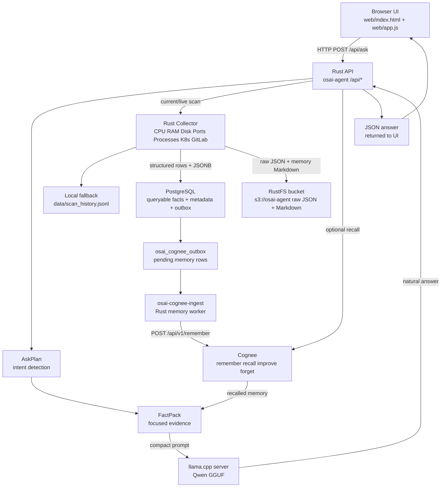

---

## 3. Important correction: data does not move by itself

You asked about:

```text
UI -> Rust
Rust -> PostgreSQL
PostgreSQL -> RustFS
RustFS -> Cognee
Cognee -> Rust
Rust -> UI
```

The better technical understanding is:

```text
UI -> Rust
Rust -> PostgreSQL
Rust -> RustFS
Rust -> PostgreSQL outbox
Rust cognee-ingest worker -> Cognee
Rust -> Cognee recall
Rust -> Qwen
Rust -> UI
```

PostgreSQL does not automatically push to RustFS.
RustFS does not automatically push to Cognee.
Cognee does not automatically decide what is true.

Rust workers orchestrate all movement.

---

## 4. Scan data lifecycle

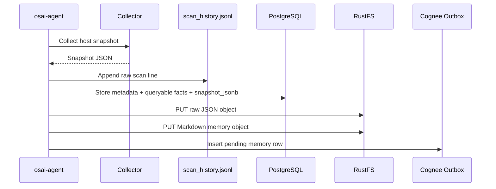

### What the scan contains

From your uploaded `scan_history.jsonl` sample, one scan already contains:

```text
Host:
  hostname: ManE
  generated_at: 2026-07-08T15:46:26Z
  highest_severity: critical

OS:
  Ubuntu 23.10
  WSL2 kernel 5.15.146.1-microsoft-standard-WSL2

CPU:
  physical_cores: 6
  logical_cpus: 12
  global_cpu_usage_percent: 5.42
  one CPU core at 100%

Memory:
  total: about 3.8 GB
  used: about 994 MB
  available: about 2.8 GB
  swap used: about 38 MB

Storage:
  /mnt/c at 98.3% used
  /usr/lib/wsl/drivers at 98.3% used
  / at 33.6% used

Ports:
  22, 53, 80, 5432, 8001, 8080, 9000, 9001

Processes:
  llama-server
  dockerd

Service/database hints:
  docker detected
  postgresql detected by listening port 5432

Kubernetes:
  kubectl binary detected

Findings:
  2 critical disk findings
  2 PostgreSQL sensitive-port info findings
  1 Kubernetes info finding
```

This proves the collector is already producing strong evidence. The next production improvement is organizing this evidence into PostgreSQL tables for query/search.

---

## 5. UI to Rust API flow

When the browser asks:

```text
what my cpu doing
```

The browser sends:

```http
POST /api/ask HTTP/1.1
Host: 127.0.0.1:8000
Content-Type: application/json

{
  "question": "what my cpu doing",
  "use_ai": true
}
```

Rust receives this at `/api/ask`.

Then Rust should do:

```text
1. Read the question.
2. Normalize messy human wording.
3. Detect intent using AskPlan.
4. Build focused FactPack.
5. Decide whether Cognee is needed.
6. Decide whether Qwen is needed.
7. Return answer and evidence to UI.
```

### UI to Rust diagram

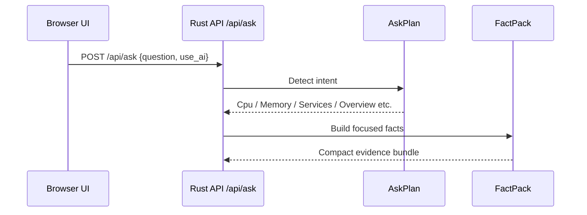

---

## 6. AskPlan and FactPack flow

### AskPlan

AskPlan is Rust's understanding of the user's question.

Example:

```json
{
  "original_question": "what my cpu doing",
  "intents": ["Cpu"],
  "depth": "Short",
  "use_cognee": false,
  "llm_max_tokens": 80
}
```

### FactPack

FactPack is the small evidence bundle created from the AskPlan.

For CPU:

```text
CPU facts only:
  - global CPU usage
  - logical CPU count
  - high-use cores
  - top CPU processes
  - CPU-related findings
  - safe manual checks
```

For memory:

```text
Memory facts only:
  - total memory
  - used memory
  - available memory
  - swap usage
  - memory severity
  - safe manual checks
```

For services:

```text
Service facts only:
  - detected services
  - detected apps
  - detected databases
  - failed services if available
  - service-related findings
  - safe manual checks
```

### AskPlan + FactPack diagram

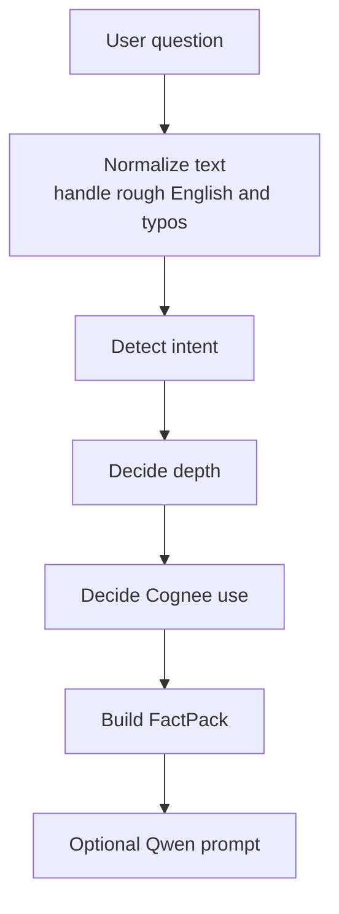

---

## 7. Rust to PostgreSQL

PostgreSQL should be the queryable operational source of truth.

It should store:

```text
1. scan metadata
2. snapshot JSONB
3. CPU metrics
4. memory metrics
5. storage metrics
6. listening ports
7. process samples
8. service hints
9. database hints
10. Kubernetes/GitLab signals
11. findings
12. Cognee outbox rows
13. RustFS object keys
```

PostgreSQL is good here because it supports both relational tables and JSONB. JSONB lets you preserve full nested scan data, while relational tables make dashboards and filters fast.

### Recommended PostgreSQL schema

```sql
create table if not exists osai_scan_history (
    id text primary key,
    hostname text not null,
    generated_at timestamptz not null,
    highest_severity text,
    finding_count integer,
    warn_count integer,
    critical_count integer,
    snapshot_jsonb jsonb not null,
    raw_object_key text,
    memory_object_key text
);

create table if not exists osai_cpu_metrics (
    scan_id text references osai_scan_history(id),
    hostname text not null,
    generated_at timestamptz not null,
    physical_cores integer,
    logical_cpus integer,
    global_cpu_usage_percent numeric,
    max_core_usage_percent numeric
);

create table if not exists osai_memory_metrics (
    scan_id text references osai_scan_history(id),
    hostname text not null,
    generated_at timestamptz not null,
    total_bytes bigint,
    used_bytes bigint,
    available_bytes bigint,
    total_swap_bytes bigint,
    used_swap_bytes bigint,
    used_percent numeric,
    swap_used_percent numeric
);

create table if not exists osai_storage_mounts (
    scan_id text references osai_scan_history(id),
    hostname text not null,
    generated_at timestamptz not null,
    name text,
    mount_point text,
    file_system text,
    total_bytes bigint,
    available_bytes bigint,
    used_percent numeric
);

create table if not exists osai_listening_ports (
    scan_id text references osai_scan_history(id),
    hostname text not null,
    generated_at timestamptz not null,
    protocol text,
    port integer,
    state text,
    local_address_raw text,
    exposure text
);

create table if not exists osai_process_samples (
    scan_id text references osai_scan_history(id),
    hostname text not null,
    generated_at timestamptz not null,
    pid text,
    name text,
    status text,
    cpu_usage_percent numeric,
    memory_bytes bigint
);

create table if not exists osai_findings (
    scan_id text references osai_scan_history(id),
    hostname text not null,
    generated_at timestamptz not null,
    rule_id text,
    severity text,
    category text,
    title text,
    detail text,
    recommendation text,
    command_suggestion text,
    requires_approval boolean,
    plugin text
);

create table if not exists osai_service_hints (
    scan_id text references osai_scan_history(id),
    hostname text not null,
    generated_at timestamptz not null,
    name text,
    source text,
    confidence text
);

create table if not exists osai_database_hints (
    scan_id text references osai_scan_history(id),
    hostname text not null,
    generated_at timestamptz not null,
    name text,
    detected_by text,
    confidence text
);

create table if not exists osai_cognee_outbox (
    id bigserial primary key,
    scan_id text references osai_scan_history(id),
    dataset_name text,
    memory_markdown text,
    memory_object_key text,
    status text default 'pending',
    attempt_count integer default 0,
    last_error text,
    created_at timestamptz default now(),
    ingested_at timestamptz
);
```

### Useful indexes

```sql
create index if not exists idx_osai_scan_history_time
on osai_scan_history (generated_at desc);

create index if not exists idx_osai_scan_history_host_time
on osai_scan_history (hostname, generated_at desc);

create index if not exists idx_osai_scan_history_severity
on osai_scan_history (highest_severity, generated_at desc);

create index if not exists idx_osai_findings_severity_time
on osai_findings (severity, generated_at desc);

create index if not exists idx_osai_findings_category_time
on osai_findings (category, generated_at desc);

create index if not exists idx_osai_ports_port_time
on osai_listening_ports (port, generated_at desc);

create index if not exists idx_osai_storage_mount_time
on osai_storage_mounts (mount_point, generated_at desc);

create index if not exists idx_osai_process_name_time
on osai_process_samples (name, generated_at desc);

create index if not exists idx_osai_scan_snapshot_gin
on osai_scan_history
using gin (snapshot_jsonb);
```

PostgreSQL GIN indexes are useful for composite values where the query searches for elements inside the composite item. This fits JSONB scan snapshots well.

---

## 8. Rust to RustFS

RustFS is the raw evidence object store.

It should store heavy or complete objects:

```text
raw scan JSON
Markdown memory files
daily/weekly reports
pcap/pcapng packet captures
large logs
debug bundles
attachments
```

Recommended RustFS layout:

```text
s3://osai-agent/
  snapshots/
    ManE/
      2026/07/08/
        ManE-1783525586524714253.json

  memory/
    scans/
      ManE/
        2026/07/08/
          ManE-1783525586524714253.md

  reports/
    daily/
      2026/07/08/
        ManE-daily-summary.md

  captures/
    wireshark/
      ManE/
        2026/07/08/
          ask-osai-flow.pcapng
```

### Why bucket creation matters

RustFS/S3-compatible storage requires a bucket before objects can be uploaded.

If the bucket does not exist, the storage worker can reach RustFS, but upload fails with:

```text
NoSuchBucket
HTTP 404 Not Found
```

That means:

```text
Network path works.
RustFS API is reachable.
But the target bucket does not exist.
```

### Bucket creation flow

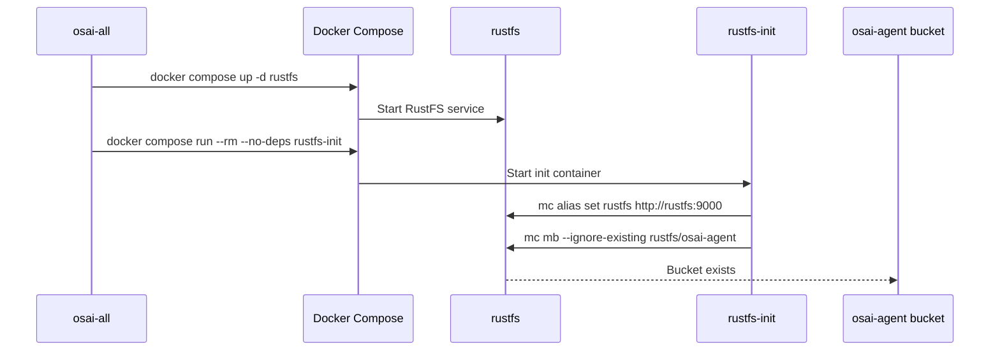

Files involved:

```text
docker-compose.storage.yml
  service: rustfs
  service: rustfs-init

scripts/ensure-rustfs-bucket.sh
  manual bucket creation helper

src/bin/osai-all.rs
  supervisor step that starts RustFS and runs rustfs-init

.env.storage
  defines OBJECT_STORE_BUCKET=osai-agent

src/bin/osai-storage-worker.rs
  uploads objects to the bucket; it should not be the main bucket creator
```

---

## 9. PostgreSQL + RustFS together

PostgreSQL and RustFS should be linked by object keys.

Example PostgreSQL row:

```text
scan_id: ManE-1783525586524714253
hostname: ManE
generated_at: 2026-07-08T15:46:26Z
highest_severity: critical
raw_object_key: snapshots/ManE/2026/07/08/ManE-1783525586524714253.json
memory_object_key: memory/scans/ManE/2026/07/08/ManE-1783525586524714253.md
```

This gives you:

```text
PostgreSQL = fast search/filter/chart/query
RustFS     = exact full evidence object
```

Your HTML UI should query PostgreSQL first. If the user wants the original full scan, the UI can fetch the RustFS object by key.

---

## 10. Rust to Cognee

Cognee should receive curated memory, not raw giant JSON.

Best flow:

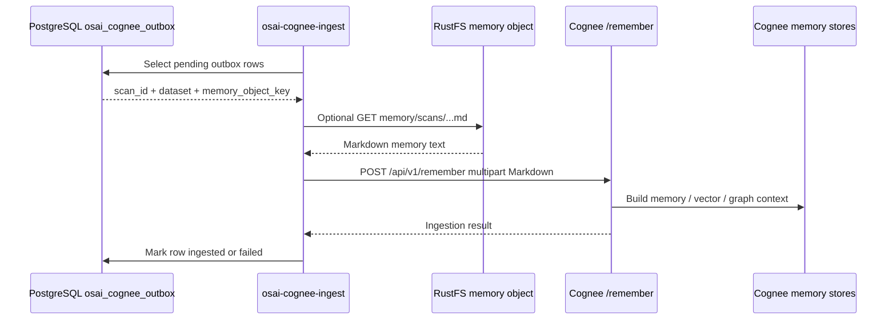

### What Cognee should store

Cognee should store descriptive memory such as:

```markdown
# OSAI Scan Memory

Host: ManE
Generated: 2026-07-08T15:46:26Z
Severity: critical

## Important findings

- Critical disk usage on /mnt/c: 98.3% used.
- Critical disk usage on /usr/lib/wsl/drivers: 98.3% used.
- PostgreSQL port 5432 is listening.
- Kubernetes signal detected: kubectl binary found.

## Evidence

- CPU usage: 5.42%
- Logical CPUs: 12
- Memory used: about 994 MB
- Listening ports: 22, 53, 80, 5432, 8001, 8080, 9000, 9001

## Safe checks

- df -h
- du -xh /mnt/c --max-depth=1
- ss -tulpen
- kubectl get pods -A -o wide
```

Cognee is best for:

```text
previous incidents
repeated issue patterns
semantic recall
operator feedback
relationship memory
```

Cognee should not replace PostgreSQL for exact dashboard queries.

---

## 11. Cognee back to Rust

When the user asks:

```text
what happened before with disk?
```

Rust should decide:

```text
Intent: Storage
Needs Cognee: yes
Recall query: previous disk pressure incidents for host ManE
```

Then:

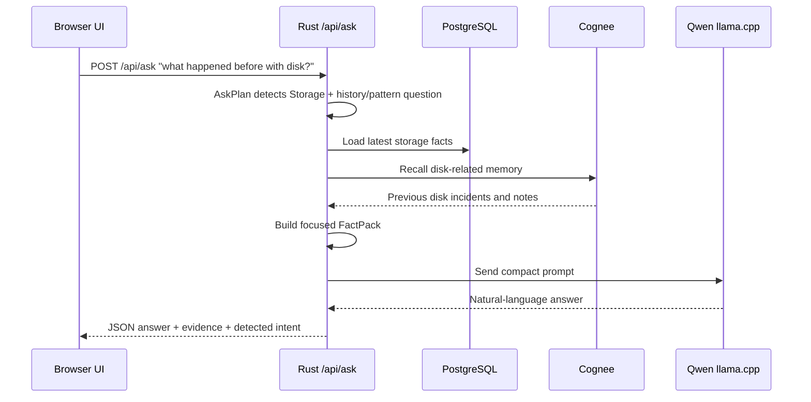

The UI should show:

```text
Detected intent: Storage
Data sent to AI: storage facts + recalled storage memory
AI used: yes
Cognee used: yes
Facts sent: 8
Manual checks: 3
```

---

## 12. Rust to Qwen

Qwen should only receive bounded facts.

Bad prompt:

```text
Here is the whole server snapshot. Figure out what is wrong.
```

Good prompt:

```text
Role:
You are OSAI. Rust facts are source of truth.

User question:
what my cpu doing

Detected intent:
Cpu

Relevant facts:
- Global CPU usage: 5.42%
- Logical CPUs: 12
- Highest single core usage: 100%
- Top process: llama-server

Safe manual checks:
- uptime
- top -o %CPU
- ps -eo pid,comm,%cpu,%mem --sort=-%cpu | head

Rules:
- Answer only from facts.
- Be short and clear.
- Do not invent facts.
- Do not output <think>.
```

Qwen's job:

```text
explain the facts in plain language
summarize severity
recommend safe checks
avoid hallucination
```

Qwen's job is not:

```text
scan the OS
query PostgreSQL directly
read RustFS directly
decide whether commands are safe
execute commands
```

---

## 13. Final answer back to UI

The API response should include more than just text.

Recommended response:

```json
{
  "answer": "CPU is mostly low overall at 5.42%, but one core is busy at 100%. The main visible CPU process is llama-server. This is not a full-system CPU problem unless it stays high or causes slow responses.",
  "mode": "focused_factpack",
  "ai_used": true,
  "cognee_used": false,
  "detected_intents": ["Cpu"],
  "fact_pack_summary": {
    "title": "CPU status",
    "facts_sent": 4,
    "findings_sent": 0,
    "manual_checks": 3
  },
  "manual_checks": [
    "uptime",
    "top -o %CPU",
    "ps -eo pid,comm,%cpu,%mem --sort=-%cpu | head"
  ]
}
```

UI should show:

```text
Detected: CPU
Data sent to AI: CPU facts only
AI used: yes
Cognee used: no
Mode: focused FactPack
```

---

## 14. OSI model view

OSAI data movement is mostly HTTP/TCP plus PostgreSQL protocol/TCP.

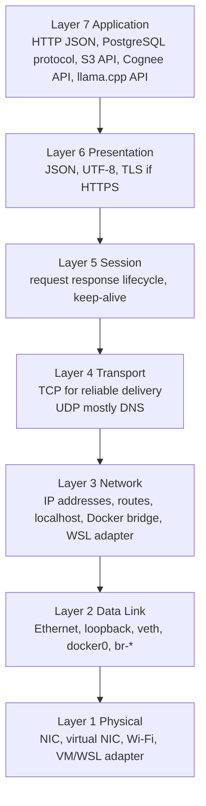

### OSAI ports

```text
8000  Rust dashboard/API
5432  PostgreSQL
9000  RustFS S3-compatible API
9001  RustFS console
8001  Cognee REST API
8080  llama.cpp/Qwen API
443   Cognee cloud, if using cloud tenant
53    DNS, often UDP
```

### TCP paths

```text
Browser -> Rust API
  HTTP over TCP port 8000

Rust -> PostgreSQL
  PostgreSQL wire protocol over TCP port 5432

Rust -> RustFS
  S3-compatible HTTP over TCP port 9000

Rust -> Cognee local
  HTTP over TCP port 8001

Rust -> Cognee cloud
  HTTPS over TCP port 443

Rust -> llama.cpp/Qwen
  HTTP over TCP port 8080
```

### UDP paths

UDP may appear for:

```text
DNS lookup
some local resolver traffic
time sync
container networking support traffic
```

But the important OSAI application data uses TCP.

---

## 15. Wireshark and tcpdump visibility

Wireshark/tcpdump help you prove whether data is travelling correctly.

You can inspect:

```text
TCP handshake
HTTP method
URL path
status code
JSON body for local unencrypted HTTP
request/response timing
connection refused
HTTP 401 token errors
HTTP 404 NoSuchBucket errors
large Qwen request bodies
retransmissions
resets
```

If traffic is HTTPS, such as Cognee cloud over port 443, you usually cannot see the decrypted body unless TLS decryption is configured. You can still see IPs, ports, timing, packet sizes, and failures.

---

## 16. Capture UI to Rust

Use this when testing dashboard Ask OSAI.

```bash
sudo tcpdump -i lo -nn -s 0 -w osai-ui-to-rust.pcap 'tcp port 8000'
```

Open:

```bash
wireshark osai-ui-to-rust.pcap
```

Useful Wireshark filters:

```text
tcp.port == 8000
http
http.request.method == "POST"
http.request.uri contains "/api/ask"
http.response.code == 401
```

If you see:

```text
HTTP/1.1 401 Unauthorized
```

then the UI reached Rust, but Rust rejected it due to token/auth configuration.

---

## 17. Capture Rust to Qwen

Use this to confirm that AskPlan + FactPack is working.

```bash
sudo tcpdump -i lo -nn -s 0 -w osai-rust-to-qwen.pcap 'tcp port 8080'
```

Useful Wireshark filters:

```text
tcp.port == 8080
http.request.uri contains "/v1/chat/completions"
```

For this question:

```text
what my cpu doing
```

The request body should be small.

It should contain:

```text
CPU facts
CPU checks
CPU intent
```

It should not contain:

```text
full server snapshot
all storage mounts
all Kubernetes data
full scan_history.jsonl
large unrelated knowledge files
```

If the Qwen request is huge, the intent path is still leaking too much context.

---

## 18. Capture Rust to RustFS

Use this when testing object upload and bucket problems.

```bash
sudo tcpdump -i lo -nn -s 0 -w osai-rustfs-put.pcap 'tcp port 9000'
```

Useful filters:

```text
tcp.port == 9000
http.request.method == "PUT"
http.request.uri contains "/osai-agent/"
http.response.code == 404
```

Expected upload requests:

```text
PUT /osai-agent/snapshots/ManE/...
PUT /osai-agent/memory/scans/ManE/...
```

If bucket is missing:

```text
HTTP 404 Not Found
NoSuchBucket
```

Meaning:

```text
RustFS is reachable.
The network is not the problem.
The bucket was not created.
```

---

## 19. Capture Rust to PostgreSQL

```bash
sudo tcpdump -i lo -nn -s 0 -w osai-postgres.pcap 'tcp port 5432'
```

Useful filter:

```text
tcp.port == 5432
```

PostgreSQL protocol is not as readable as HTTP, but this still helps check:

```text
connection attempt
connection refused
timeout
reset
packet flow
query volume
```

For exact SQL debugging, use PostgreSQL logs or `psql` queries, not Wireshark alone.

---

## 20. Capture Docker bridge traffic

Your scan shows Docker bridge and veth interfaces, such as:

```text
docker0
br-*
veth*
```

List interfaces:

```bash
ip link show
```

Capture everything relevant:

```bash
sudo tcpdump -i any -nn -s 0 -w osai-all.pcap \
  'tcp port 8000 or tcp port 8080 or tcp port 9000 or tcp port 9001 or tcp port 5432 or tcp port 8001'
```

Open:

```bash
wireshark osai-all.pcap
```

Useful filters:

```text
tcp.port == 8000
 tcp.port == 8080
 tcp.port == 9000
 tcp.port == 5432
 tcp.port == 8001
http.response.code >= 400
```

---

## 21. How to organize scan_history.jsonl better

Keep `scan_history.jsonl`, but do not make it the main query engine.

Use it as:

```text
raw local fallback
append-only audit trail
replay source
emergency recovery
simple debug artifact
```

For UI search/query, move important fields into PostgreSQL.

### Three-layer storage strategy

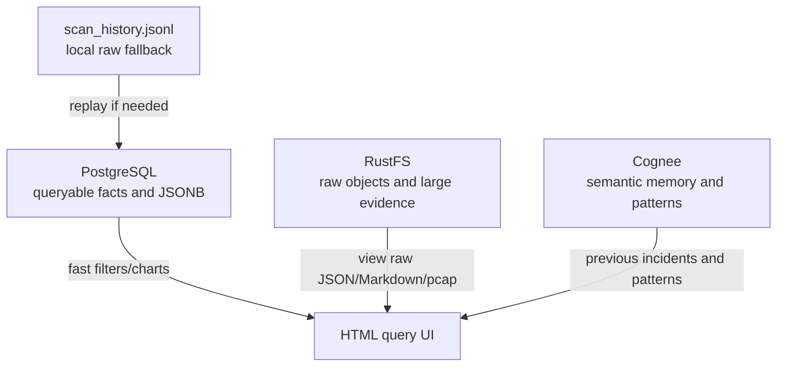

### What to keep where

| Data | Best place | Why |
|---|---|---|
| One full raw scan line | JSONL | Local fallback and audit |
| Full snapshot JSON | PostgreSQL JSONB + RustFS JSON | Query + raw evidence |
| CPU/memory/storage metrics | PostgreSQL tables | Fast filtering and charts |
| Findings | PostgreSQL table | Severity/category search |
| Raw JSON object | RustFS | Evidence vault |
| Markdown memory | RustFS + PostgreSQL outbox | Human/LLM-readable memory |
| Previous incident memory | Cognee | Semantic recall |
| Packet capture `.pcapng` | RustFS | Large binary evidence |

---

## 22. HTML query feature design

Add a query panel to your UI.

### UI fields

```text
Host dropdown
Date range
Severity dropdown
Category dropdown
Port filter
Mount point filter
Process name filter
Service/database filter
Kubernetes detected yes/no
Text search
```

### API endpoints

```text
GET /api/query/scans
GET /api/query/findings
GET /api/query/storage
GET /api/query/ports
GET /api/query/processes
GET /api/query/services
GET /api/query/databases
GET /api/query/timeline
GET /api/query/raw-object/:scan_id
GET /api/query/memory-object/:scan_id
```

### UI result behavior

Each row should show:

```text
Generated time
Host
Severity
Finding count
Main issue
View raw JSON
View memory Markdown
Ask OSAI about this scan
```

---

## 23. Useful SQL for the HTML query feature

### Latest scans

```sql
select id, generated_at, hostname, highest_severity, finding_count, critical_count
from osai_scan_history
order by generated_at desc
limit 50;
```

### Critical findings

```sql
select generated_at, hostname, rule_id, title, detail, recommendation
from osai_findings
where severity = 'critical'
order by generated_at desc;
```

### Disk pressure

```sql
select generated_at, hostname, mount_point, used_percent, available_bytes
from osai_storage_mounts
where used_percent >= 90
order by generated_at desc;
```

### Disk trend for `/mnt/c`

```sql
select generated_at, hostname, mount_point, used_percent, available_bytes
from osai_storage_mounts
where mount_point = '/mnt/c'
order by generated_at desc;
```

### PostgreSQL port exposure

```sql
select generated_at, hostname, protocol, port, state, local_address_raw
from osai_listening_ports
where port = 5432
order by generated_at desc;
```

### Llama process usage

```sql
select generated_at, hostname, pid, name, cpu_usage_percent, memory_bytes
from osai_process_samples
where name ilike '%llama%'
order by generated_at desc;
```

### Kubernetes detected from JSONB

```sql
select id, generated_at, hostname
from osai_scan_history
where snapshot_jsonb @> '{"kubernetes":{"detected":true}}'::jsonb
order by generated_at desc;
```

### Scans with critical severity from JSONB

```sql
select id, generated_at, hostname, highest_severity
from osai_scan_history
where highest_severity = 'critical'
order by generated_at desc;
```

---

## 24. Views for easier UI queries

Create views so the UI does not need complex SQL.

```sql
create or replace view v_latest_host_status as
select distinct on (hostname)
    id,
    hostname,
    generated_at,
    highest_severity,
    finding_count,
    critical_count,
    raw_object_key,
    memory_object_key
from osai_scan_history
order by hostname, generated_at desc;
```

```sql
create or replace view v_critical_findings as
select
    generated_at,
    hostname,
    rule_id,
    category,
    title,
    detail,
    recommendation,
    command_suggestion
from osai_findings
where severity = 'critical'
order by generated_at desc;
```

```sql
create or replace view v_open_sensitive_ports as
select
    generated_at,
    hostname,
    protocol,
    port,
    state,
    local_address_raw
from osai_listening_ports
where port in (22, 80, 443, 5432, 6379, 8000, 8001, 8080, 9000, 9001)
order by generated_at desc;
```

```sql
create or replace view v_disk_pressure as
select
    generated_at,
    hostname,
    mount_point,
    file_system,
    used_percent,
    available_bytes
from osai_storage_mounts
where used_percent >= 80
order by generated_at desc;
```

---

## 25. Which storage answers which question?

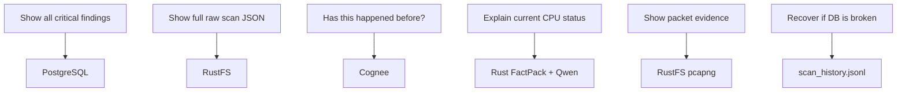

Use PostgreSQL for exact structured questions:

```text
show all critical findings
show all times port 5432 was open
show disk trend for /mnt/c
show top memory process history
```

Use RustFS for raw evidence:

```text
show the exact original scan
open generated Markdown memory
open Wireshark capture
open debug bundle
```

Use Cognee for memory/pattern questions:

```text
has this disk issue happened before?
what fix worked last time?
what did the operator say about GitLab memory?
what service pattern is repeating?
```

Use Qwen for explanation:

```text
explain this finding in simple language
summarize what is wrong
turn facts into an operator answer
```

---

## 26. Recommended next code modules

For a production-grade query feature, add:

```text
src/query.rs
  query request structs
  SQL filters
  route handlers
  response structs

src/storage_schema.rs
  table insert helpers
  metric extraction helpers

web/query.js
  HTML query panel logic

web/query.css
  query result cards/table
```

Recommended routes:

```text
GET /api/query/scans?host=ManE&severity=critical&limit=50
GET /api/query/findings?severity=critical&category=linux
GET /api/query/storage?mount=/mnt/c&min_used_percent=90
GET /api/query/ports?port=5432
GET /api/query/processes?name=llama-server
GET /api/query/timeline?host=ManE&metric=memory
GET /api/query/raw/:scan_id
GET /api/query/memory/:scan_id
```

---

## 27. End-to-end example: CPU question

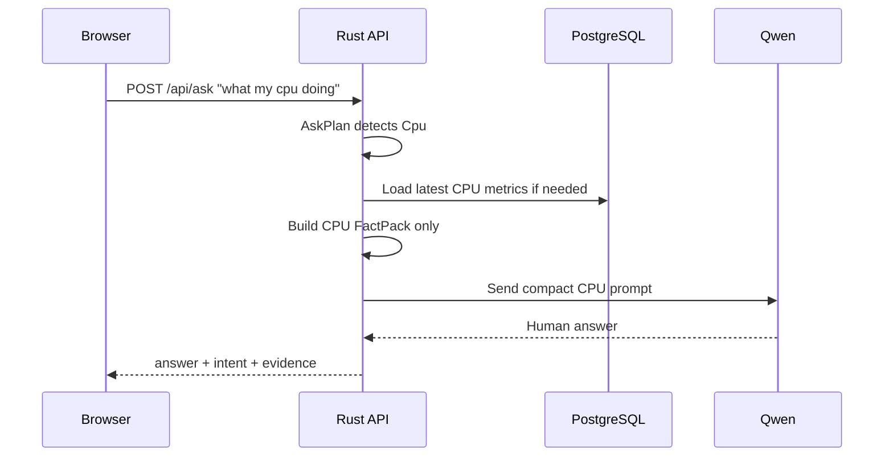

Expected behavior:

```text
Cognee: skipped
Qwen: receives CPU facts only
PostgreSQL: latest CPU/history if needed
RustFS: not needed for simple CPU answer
```

---

## 28. End-to-end example: previous disk issue

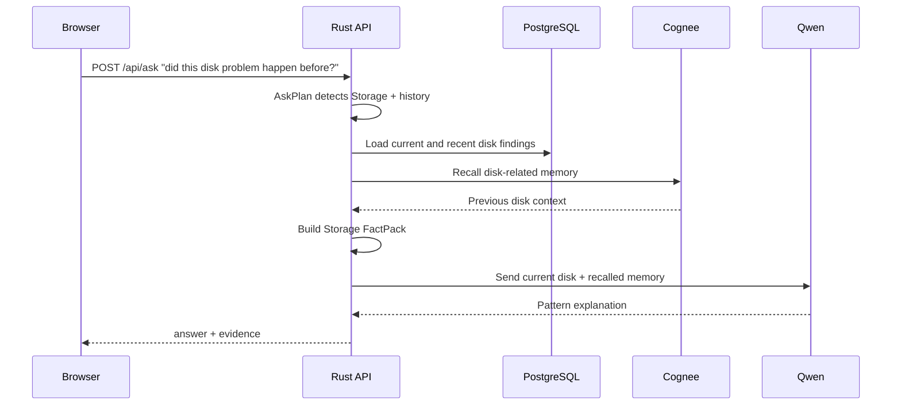

Expected behavior:

```text
Cognee: used
PostgreSQL: used for exact current/recent facts
RustFS: raw evidence available by object key
Qwen: explains only focused disk evidence
```

---

## 29. End-to-end example: scan persistence

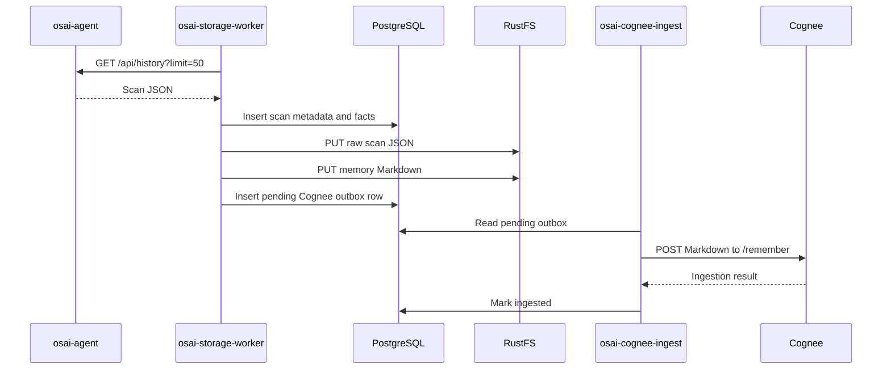

---

## 30. Final production principle

Keep the project split like this:

```text
Rust = controller, scanner, planner, guardrail, API
PostgreSQL = exact queryable operational state
RustFS = raw evidence vault
Cognee = semantic memory and previous-incident recall
Qwen = natural-language answer layer
Wireshark = packet-level truth/debugging camera
UI = human operator surface
```

The best OSAI architecture is not:

```text
Send everything to Qwen and hope it answers correctly.
```

The best OSAI architecture is:

```text
Rust understands the question.
Rust selects the right facts.
PostgreSQL answers exact queries.
RustFS preserves raw proof.
Cognee recalls past patterns.
Qwen explains only the focused evidence.
UI shows the result transparently.
```

---

## References

- PostgreSQL JSON/JSONB documentation: https://www.postgresql.org/docs/current/datatype-json.html
- PostgreSQL GIN index documentation: https://www.postgresql.org/docs/current/gin.html
- Amazon S3 CreateBucket API: https://docs.aws.amazon.com/AmazonS3/latest/API/API_CreateBucket.html
- Amazon S3 error codes, including NoSuchBucket: https://docs.aws.amazon.com/AmazonS3/latest/API/API_Error.html
- Cognee Core Concepts Overview: https://docs.cognee.ai/core-concepts/overview
- Cognee Architecture: https://docs.cognee.ai/core-concepts/architecture
- Wireshark User Guide: https://www.wireshark.org/docs/wsug_html/
- Wireshark HTTP display filter reference: https://www.wireshark.org/docs/dfref/h/http.html
