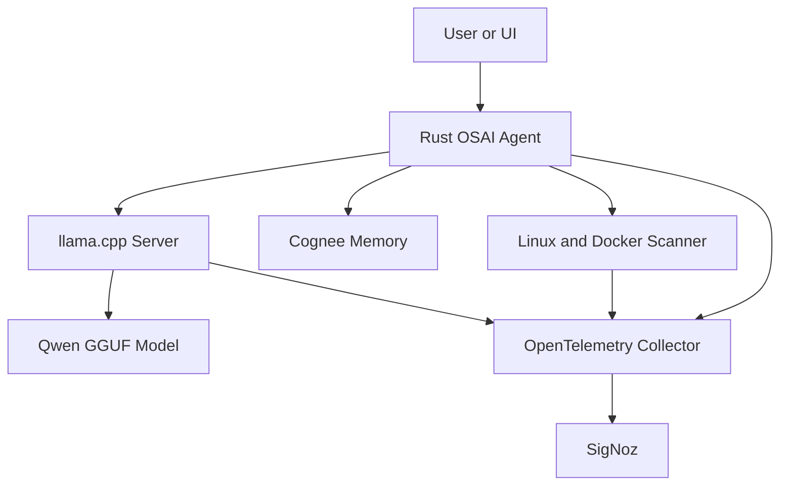
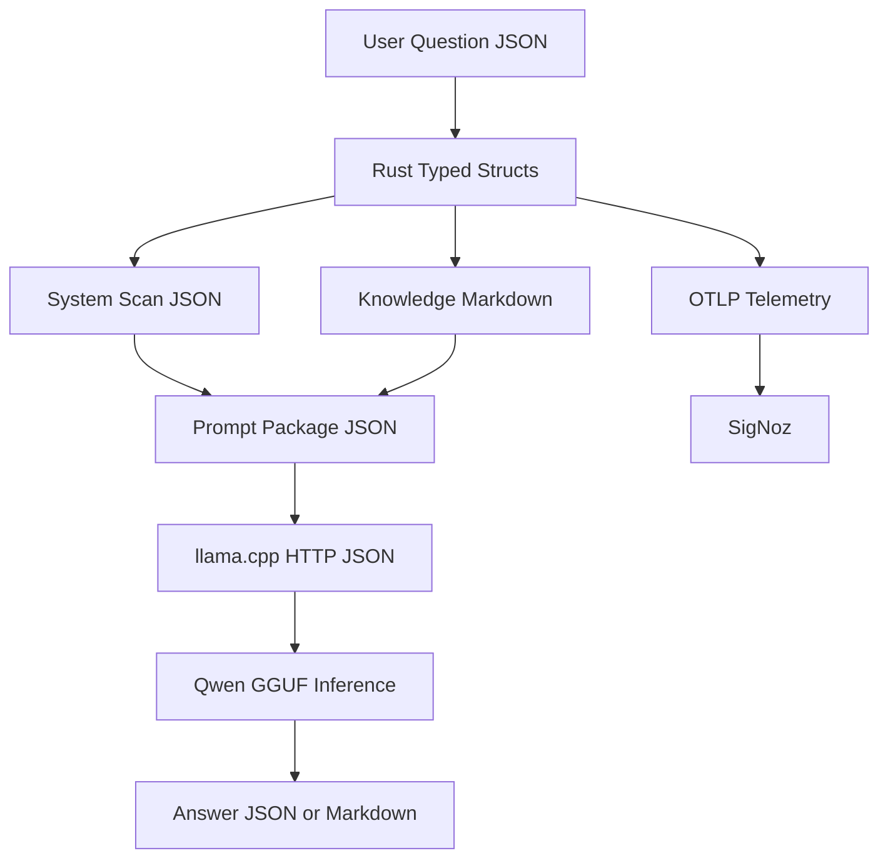
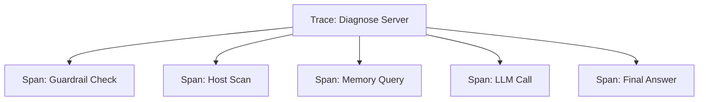
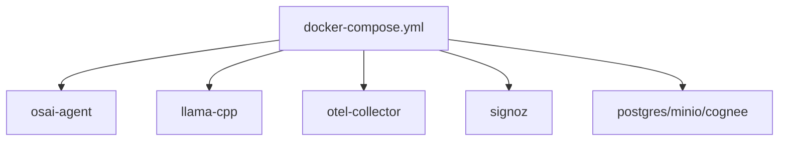
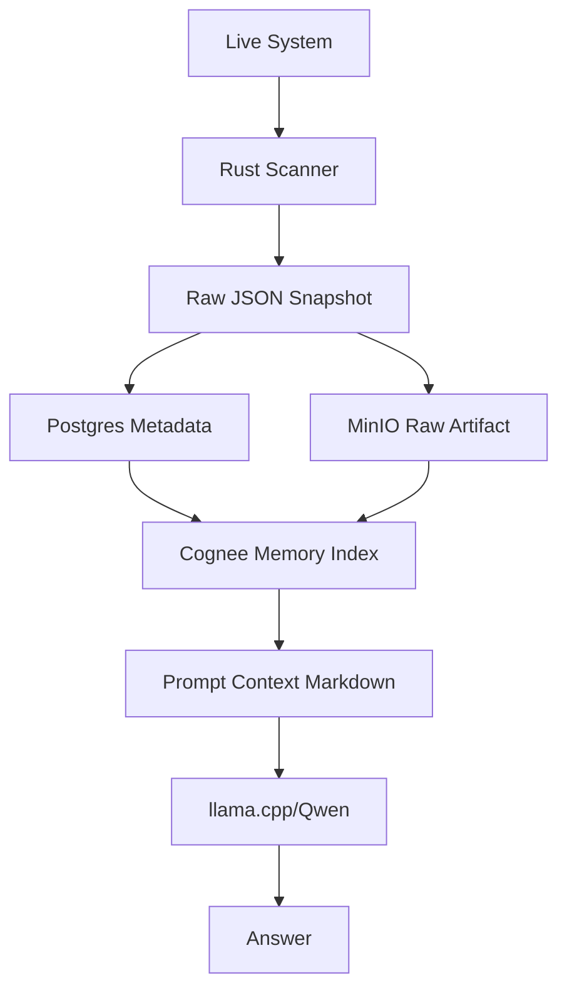
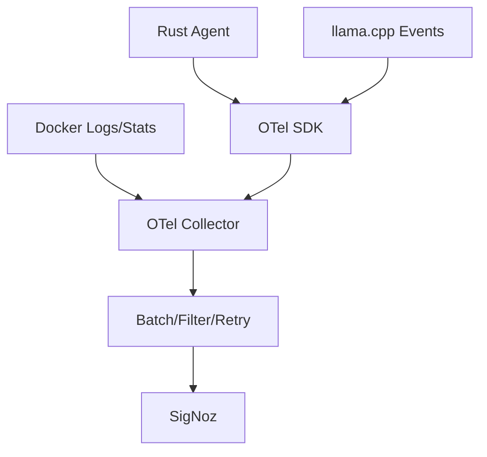

# SigNoz, OpenTelemetry, and OSAI Observability Architecture

This note explains observability in depth for a stack using Rust, Docker,
Docker Compose, llama.cpp, Qwen, and SigNoz.

The goal is simple:

> Make the AI agent, model runtime, containers, Linux host, and infrastructure
> visible, measurable, debuggable, and explainable.

## 1. Short Definition

Observability is the ability to understand the internal state of a system by
looking at the outputs it produces.

In software systems, those outputs are usually:

- Traces
- Metrics
- Logs
- Events
- Profiles
- Metadata

For OSAI, observability means:

- You know what the Rust agent is doing.
- You know which command ran.
- You know which service failed.
- You know how long llama.cpp took.
- You know how Qwen was called.
- You know which container used CPU/RAM.
- You know when Docker, Postgres, MinIO, Cognee, or the model runtime became
  unhealthy.
- You can connect one user question to every internal step taken by the agent.

Without observability, the AI agent becomes a black box. With observability, it
becomes an inspectable system.

## 2. The Problem It Solves

Modern AI and DevOps systems are distributed. One user request may touch many
parts:

- API server
- Rust agent
- Linux command executor
- Docker engine
- Postgres
- MinIO
- Cognee memory
- llama.cpp server
- Qwen model
- Dashboard or UI

If the final answer is slow, wrong, or missing, guessing is painful.

Observability answers:

- Where did the request spend time?
- Which step failed?
- Which dependency was unavailable?
- Was the model slow or was the system scan slow?
- Did the prompt become too large?
- Did Docker restart a container?
- Did memory pressure make llama.cpp slow?
- Did a previous incident have the same pattern?

Example:

```text
User asks: "Why is my server slow?"

Possible hidden failures:
- Rust agent is healthy, but docker inspect is slow.
- Docker is healthy, but llama.cpp is overloaded.
- llama.cpp is healthy, but Qwen context is too large.
- Qwen is healthy, but Cognee memory lookup is slow.
- Everything is healthy, but the host has 95% RAM usage.
```

Observability turns this from guessing into evidence.

## 3. Core Terms

| Term | Proper Definition | Why It Matters In OSAI |
|---|---|---|
| Observability | Ability to understand internal system state from external outputs. | Lets you debug the AI agent, infra, and model runtime. |
| Telemetry | Data emitted by software or infrastructure to describe runtime behavior. | Rust agent emits logs, metrics, traces, and events. |
| Instrumentation | Code or config added to emit telemetry. | Rust code must create spans, counters, logs, and attributes. |
| Trace | End-to-end journey of one request across services. | Shows user request -> scan -> memory -> model -> response. |
| Span | One timed operation inside a trace. | Examples: `scan_cpu`, `docker_ps`, `call_llama_cpp`. |
| Metric | Numeric measurement over time. | CPU, RAM, request count, error count, model latency. |
| Log | Timestamped record of an event. | Useful for detailed messages and error explanation. |
| Event | Important occurrence at a point in time. | Example: `container_restarted`, `repair_rejected`. |
| Profile | Code-level resource usage view. | Shows which code path uses CPU or memory. |
| Attribute | Key-value metadata attached to telemetry. | `model=qwen3`, `host=alma-vm`, `container=llama-cpp`. |
| Resource | Entity that produced telemetry. | Host, container, service, VM, Kubernetes pod. |
| OTLP | OpenTelemetry Protocol used to send telemetry. | Standard path from Rust/Collector to SigNoz. |
| Collector | Service that receives, processes, batches, filters, and exports telemetry. | Keeps app code simpler and centralizes telemetry routing. |
| Backend | Storage and query system for telemetry. | SigNoz stores and queries traces, logs, and metrics. |
| Dashboard | Visual view of telemetry. | Shows AI latency, container health, and infra state. |
| Alert | Rule that notifies when a condition is bad. | llama.cpp down, RAM high, error rate high. |

## 4. OpenTelemetry Definition

OpenTelemetry is a vendor-neutral observability framework and toolkit. It
defines APIs, SDKs, conventions, and the OTLP protocol for generating,
collecting, processing, and exporting telemetry data.

OpenTelemetry is not the final dashboard. It is the standard way to produce and
move telemetry.

In OSAI, OpenTelemetry answers:

- What format should Rust use to emit traces?
- What format should metrics follow?
- How do services describe themselves?
- How do trace IDs move between services?
- How can the same telemetry be sent to SigNoz today and another backend later?

Important point:

> OpenTelemetry gives you the standard. SigNoz gives you the backend, UI,
> dashboards, query layer, alerts, and debugging experience.

## 5. SigNoz Definition

SigNoz is an open-source observability platform. It receives telemetry such as
traces, metrics, and logs, stores it, correlates it, and gives a UI for
dashboards, alerts, trace exploration, log search, and infrastructure
monitoring.

In OSAI, SigNoz is the place where you see:

- Rust agent request traces
- AI workflow traces
- llama.cpp latency
- Qwen call success/failure
- Docker container logs
- Host CPU/RAM/disk/network metrics
- Error trends
- Alerts
- Dashboards

## 6. Why This Matters For Rust + AI Agent Stack

Rust is fast and reliable, but speed alone is not enough. A production agent
must be explainable.

Your Rust agent may perform sensitive DevOps tasks:

- Inspect services
- Read logs
- Check ports
- Scan Docker containers
- Query Kubernetes
- Ask Qwen for reasoning
- Suggest repair commands
- Store incidents in memory

For each step, you need evidence:

- What input came in?
- What command was chosen?
- Was it allowed by guardrails?
- What output came back?
- Was output summarized before sending to the model?
- How much time did Qwen take?
- Did the final answer use memory or live system state?

This is why observability is not optional. It is part of the safety and
production story.

## 7. Recommended Data Formats In This Stack

Different layers need different formats. Do not force one format everywhere.

| Layer | Preferred Format | Why |
|---|---|---|
| User request to Rust API | JSON | Easy for HTTP APIs, UI, CLI, and agents. |
| Rust internal structs | Typed Rust structs | Compile-time safety and clear contracts. |
| Rust logs | Structured JSON logs | Easy to parse, search, and ship. |
| Rust traces/metrics | OpenTelemetry OTLP | Standard telemetry format for SigNoz. |
| Collector config | YAML | Standard for OpenTelemetry Collector and Docker Compose configs. |
| Docker Compose | YAML | Native format for Docker Compose. |
| Knowledge/runbooks | Markdown | Human-readable and good for AI context. |
| AI prompt package | JSON plus Markdown blocks | JSON for structure, Markdown for readable context. |
| llama.cpp API request | JSON | llama.cpp server exposes HTTP-style model calls. |
| Qwen model file | GGUF | Efficient local model file format used by llama.cpp. |
| Incident memory record | JSON metadata plus Markdown summary | Machine-queryable plus human-readable. |
| Long-term object artifact | JSON/Markdown file in object storage | Useful for replay, audit, and recovery. |
| Dashboard definitions | JSON/YAML depending on tool | Portable configuration. |

Best rule:

> Use JSON for machines, Markdown for human knowledge, YAML for deployment
> config, OTLP for telemetry, and GGUF for local model weights.

## 8. Full Architecture



Explanation:

- User sends a request to the Rust agent.
- Rust agent scans Linux, Docker, services, ports, and logs.
- Rust agent queries memory when needed.
- Rust agent calls llama.cpp, which runs Qwen.
- Rust, scanner, and model runtime emit telemetry.
- OpenTelemetry Collector receives and processes telemetry.
- SigNoz stores and visualizes it.

## 9. Data Transfer Diagram



The important distinction:

- JSON carries structured machine data.
- Markdown carries readable knowledge and runbooks.
- OTLP carries observability data.
- GGUF carries the model weights.

## 10. Request Lifecycle Example

User asks:

```json
{
  "question": "Why is my Docker container slow?",
  "target": "local-server",
  "mode": "diagnose"
}
```

Rust converts it into an internal request:

```rust
struct DiagnoseRequest {
    question: String,
    target: String,
    mode: DiagnoseMode,
}
```

Rust starts a trace:

```text
trace: diagnose_request
  span: parse_user_request
  span: check_guardrails
  span: scan_docker
  span: scan_host_resources
  span: query_memory
  span: build_prompt
  span: call_llama_cpp
  span: generate_final_answer
```

Rust collects system data:

```json
{
  "host": "alma-dev-vm",
  "containers": [
    {
      "name": "llama-cpp",
      "status": "running",
      "cpu_percent": 87.3,
      "memory_mb": 5230,
      "restart_count": 0
    }
  ],
  "host_memory": {
    "used_percent": 91.4
  }
}
```

Rust combines live data with Markdown knowledge:

```md
## Known Pattern

If llama.cpp is slow and host memory is above 90%, reduce context size,
use a smaller quantized model, or stop competing containers.
```

Rust sends a JSON request to llama.cpp:

```json
{
  "model": "qwen3",
  "messages": [
    {
      "role": "system",
      "content": "You are OSAI, a cautious DevOps diagnostic agent."
    },
    {
      "role": "user",
      "content": "Analyze the following Docker and host data..."
    }
  ],
  "temperature": 0.2
}
```

Rust records model telemetry:

```json
{
  "event": "llm_call_completed",
  "model": "qwen3",
  "runtime": "llama.cpp",
  "latency_ms": 15320,
  "success": true,
  "prompt_tokens_estimate": 1800,
  "completion_tokens_estimate": 320
}
```

SigNoz then shows:

- One trace for the full request.
- Spans showing each step and duration.
- Logs for details.
- Metrics for trends.
- Alerts if thresholds are crossed.

## 11. What To Instrument In Rust

Your Rust agent should emit telemetry around these areas:

| Area | Trace Span | Metrics | Logs |
|---|---|---|---|
| HTTP request | `http.request` | request count, latency | request accepted/rejected |
| Guardrails | `guardrail.check` | blocked command count | reason for block |
| System scan | `host.scan` | scan duration | command summary |
| Docker scan | `docker.scan` | container count, restart count | unhealthy container details |
| Memory lookup | `memory.query` | memory latency | matched incident IDs |
| Prompt build | `prompt.build` | prompt size estimate | included context sources |
| llama.cpp call | `llm.call` | latency, token estimate, errors | model/runtime status |
| Final answer | `answer.generate` | answer latency | confidence and source type |
| Repair action | `action.propose` | approval count | command proposed |

## 12. Metrics To Track

Important OSAI metrics:

- `osai_requests_total`
- `osai_request_duration_ms`
- `osai_scan_duration_ms`
- `osai_guardrail_blocks_total`
- `osai_docker_unhealthy_containers`
- `osai_host_cpu_percent`
- `osai_host_memory_percent`
- `osai_host_disk_percent`
- `osai_llm_latency_ms`
- `osai_llm_errors_total`
- `osai_prompt_tokens_estimated`
- `osai_completion_tokens_estimated`
- `osai_memory_query_duration_ms`
- `osai_incident_matches_total`
- `osai_repair_suggestions_total`
- `osai_repair_actions_approved_total`
- `osai_repair_actions_rejected_total`

These metrics help prove the agent is production-ready.

## 13. Logs To Keep Structured

Prefer JSON logs from Rust:

```json
{
  "timestamp": "2026-07-07T20:15:31+05:30",
  "level": "INFO",
  "service": "osai-agent",
  "trace_id": "abc123",
  "span_id": "scan001",
  "event": "docker_scan_completed",
  "containers_total": 8,
  "unhealthy": 1
}
```

Avoid plain logs like:

```text
Docker scan done
```

Plain logs are readable but weak for filtering, dashboards, and correlation.

## 14. Trace Design For AI Agent

The trace is the strongest part of an AI observability project.



Each span should include attributes:

```text
service.name=osai-agent
host.name=alma-dev-vm
deployment.environment=local
llm.runtime=llama.cpp
llm.model=qwen3
scan.target=docker
guardrail.result=allowed
```

This lets SigNoz filter by service, host, model, environment, and failure type.

## 15. Docker Compose Role

Docker Compose is not the observability system. It is the local orchestration
layer.

It starts the services:

- `osai-agent`
- `llama-cpp`
- `otel-collector`
- `signoz`
- `postgres`
- `minio`
- `cognee`

Docker Compose uses YAML because deployment configuration needs to be readable,
versionable, and declarative.

Example service map:



## 16. What Each Component Owns

| Component | Main Job | Data It Handles |
|---|---|---|
| Rust Agent | Control plane, scanner, API, workflow engine | JSON, Rust structs, logs, OTLP |
| Docker Compose | Local orchestration | YAML |
| Docker | Container runtime | container logs, stats, events |
| llama.cpp | Local inference server | HTTP JSON request/response, GGUF model |
| Qwen | Reasoning model | prompt text, generated text |
| Cognee | Memory and retrieval | documents, chunks, graph/vector metadata |
| Postgres | Structured persistence | rows, JSONB, metadata |
| MinIO | Object/artifact storage | JSON files, Markdown files, raw logs |
| OpenTelemetry Collector | Telemetry router | OTLP, Prometheus-style metrics, logs |
| SigNoz | Observability backend/UI | traces, metrics, logs, dashboards, alerts |

## 17. Should Knowledge Be JSON Or Markdown?

Use both, but for different jobs.

Markdown is better for:

- runbooks
- human explanations
- incident notes
- architecture docs
- AI context
- troubleshooting steps

JSON is better for:

- API requests
- scan results
- metadata
- facts
- machine filtering
- audit records

Recommended incident record:

```json
{
  "incident_id": "inc_2026_07_07_001",
  "title": "llama.cpp slow due to memory pressure",
  "severity": "medium",
  "host": "alma-dev-vm",
  "service": "llama-cpp",
  "tags": ["llm", "memory", "docker"],
  "summary_md_path": "incidents/inc_2026_07_07_001.md",
  "raw_scan_json_path": "scans/inc_2026_07_07_001.json"
}
```

Recommended Markdown summary:

```md
# Incident: llama.cpp slow due to memory pressure

## Symptom

Qwen responses were taking more than 15 seconds.

## Evidence

- Host memory was above 90%.
- llama.cpp container was using high RAM.
- No Docker restart was observed.

## Fix

- Reduced model context size.
- Stopped unused containers.
- Retested model latency.
```

This gives you machine search plus human understanding.

## 18. Preferred Data Flow For OSAI



Recommended flow:

1. Rust scans the system.
2. Rust stores raw scan as JSON.
3. Rust stores metadata in Postgres.
4. Rust stores larger artifacts in MinIO.
5. Cognee indexes useful summaries and relationships.
6. Rust builds a prompt using live JSON plus Markdown memory.
7. Qwen reasons over the prepared context.
8. Observability data goes to SigNoz through OpenTelemetry.

## 19. Observability Data Flow



The Collector is important because it can:

- receive telemetry from multiple sources
- batch telemetry
- retry failed exports
- filter sensitive fields
- route telemetry to one or more backends
- reduce direct coupling between app and backend

## 20. What To Show In Hackathon Demo

Strong demo flow:

1. Start the stack with Docker Compose.
2. Ask OSAI: "Why is my AI response slow?"
3. Rust scans host and Docker.
4. Rust calls llama.cpp/Qwen.
5. Show the answer.
6. Open SigNoz.
7. Show the trace of the full request.
8. Show which span was slow.
9. Show logs for the failure or warning.
10. Show dashboard with model latency and host memory.
11. Show an alert rule for model latency or memory pressure.

This proves:

- You built an AI agent.
- You instrumented it.
- You can debug it.
- You understand DevOps and AI infrastructure.

## 21. Production Importance

Observability is important because production systems fail in partial ways.

The service may be up, but slow.
The model may answer, but with high latency.
The container may run, but consume too much memory.
The host may be reachable, but disk may be full.
The AI may respond, but use stale context.

Monitoring usually tells you "something is wrong."

Observability helps answer:

- What is wrong?
- Where is it wrong?
- Why is it wrong?
- What changed?
- What should we do next?

## 22. Minimum Viable Observability For OSAI

Start with this:

- Rust structured JSON logs.
- One trace per user request.
- Spans for scan, memory, model call, and answer.
- Metrics for request count, latency, errors, host CPU/RAM, and model latency.
- Docker Compose stack with OpenTelemetry Collector and SigNoz.
- One dashboard:
  - request latency
  - LLM latency
  - error count
  - host CPU/RAM
  - unhealthy containers
- One alert:
  - llama.cpp latency above threshold
  - OSAI error rate above threshold
  - memory above threshold

## 23. Final Mental Model

Use this mental model:

```text
Markdown = knowledge for humans and AI context
JSON = structured data for APIs and storage
YAML = deployment and collector configuration
OTLP = telemetry transfer format
GGUF = local model file format
SigNoz = observability backend and UI
OpenTelemetry = standard instrumentation and telemetry pipeline
Rust = control plane and scanner
Docker Compose = local orchestration
llama.cpp = model runtime
Qwen = reasoning model
```

The strongest project statement:

> OSAI is a Rust-based DevOps AI agent that observes Linux, Docker, and AI
> inference workflows. It uses OpenTelemetry to emit traces, metrics, and logs
> from every agent step, and SigNoz to visualize, debug, and alert on the full
> path from user question to system scan to Qwen reasoning.

## 24. References

- [OpenTelemetry: What is OpenTelemetry?](https://opentelemetry.io/docs/what-is-opentelemetry/)
- [OpenTelemetry: Signals](https://opentelemetry.io/docs/concepts/signals/)
- [OpenTelemetry Collector](https://opentelemetry.io/docs/collector/)
- [SigNoz Introduction](https://signoz.io/docs/introduction/)
