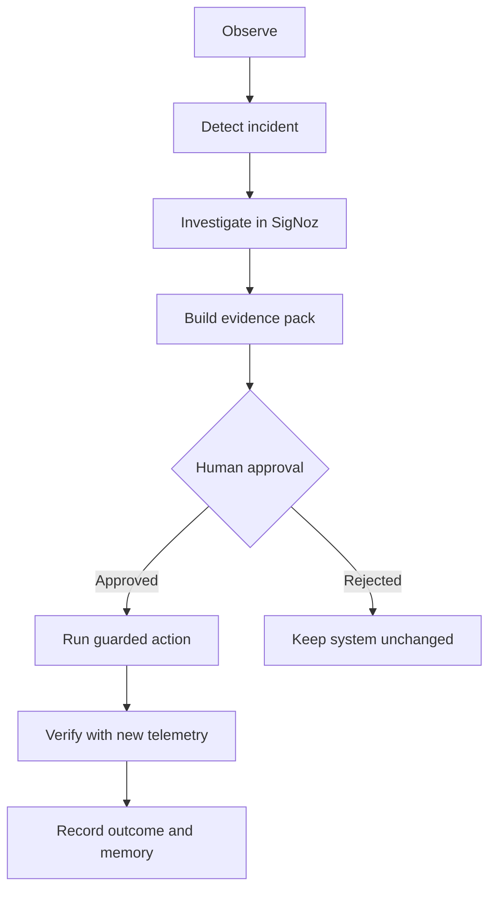
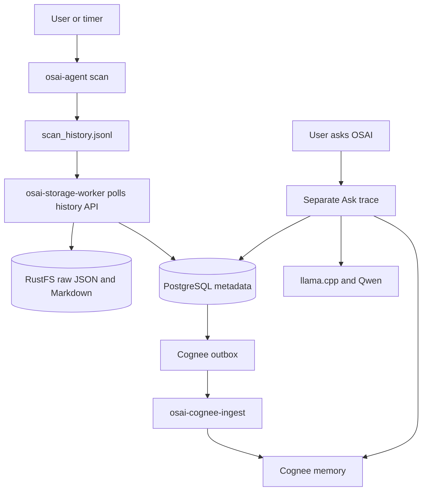

# OSAI Flight Recorder — Winning Build Blueprint

> **Positioning:** Evidence Before Action  
> **Official submission:** Track 1 — AI & Agent Observability  
> **Track 2 depth:** OpenTelemetry signals, Query Builder, dashboards, alerts, and SLOs  
> **Track 3 differentiator:** Proof-carrying remediation plus a Rust bridge for unsupported OSAI/llama.cpp events  
> **Prepared:** July 13, 2026  
> **Status:** Pre-hackathon audit, architecture notes, diagrams, and execution plan. No hackathon implementation has been performed early.

## 1. Decision

Build one project:

# **OSAI Flight Recorder: Evidence Before Action**

> **An observable, self-hosted AI SRE that cannot fix what it cannot prove.**

The current OSAI project is a strong base. Do not abandon it for a generic demo. Its real advantage is the combination of:

- Rust;
- Linux host inspection;
- local Qwen inference through llama.cpp;
- PostgreSQL metadata;
- RustFS evidence artifacts;
- Cognee memory;
- guarded command execution;
- OpenTofu and Google Cloud deployment.

The missing product idea is not merely “add SigNoz.” The stronger problem is:

> AI operations agents can propose or execute changes from incomplete or hallucinated diagnoses. OSAI Flight Recorder observes every decision and dependency, requires recent SigNoz evidence before an action can be approved, and measures the system again after the action to prove whether it helped.

This creates one closed incident loop:



That loop is a better judging story than six unrelated dashboards.

## 2. Hackathon rules that control the plan

The official event runs **July 20–26, 2026**. The rules say:

- pick one of the three tracks;
- SigNoz integration is required;
- deeper use of OpenTelemetry, traces, metrics, logs, dashboards, alerts, Query Builder, and MCP improves the submission;
- install SigNoz with Foundry;
- commit both `casting.yaml` and `casting.yaml.lock`;
- AI-assistant use must be disclosed;
- strategy, notes, sketches, and diagrams are allowed before the event;
- coding and design work for the hackathon build should start only when the hackathon begins.

Therefore:

1. Submit officially to **Track 1**.
2. Describe the Track 2 and Track 3 work as technical depth inside the same Track 1 product.
3. Ask the organizers whether one submission can be considered for multiple prizes, but do not assume it can.
4. Do not add the hackathon implementation before July 20.

Official sources:

- [Agents of SigNoz overview](https://www.wemakedevs.org/hackathons/signoz)
- [Agents of SigNoz rules](https://www.wemakedevs.org/hackathons/signoz/rules)
- [Agents of SigNoz resources](https://www.wemakedevs.org/hackathons/signoz/resources)
- [SigNoz Foundry Docker installation](https://signoz.io/docs/install/docker/)
- [Foundry Compose + MCP example](https://github.com/SigNoz/foundry/tree/main/docs/examples/docker/compose-mcp)

## 3. What already exists in the ZIP

The uploaded repository is not a toy. It contains approximately:

- 6,917 lines of Rust application code;
- 4,748 lines of shell/OpenTofu setup code;
- 1,698 lines of browser UI code;
- a Rust Axum API and embedded UI;
- Linux scanner, deterministic rules, history, knowledge, and plugins;
- Ask OSAI with PostgreSQL facts, Cognee recall, and llama.cpp/Qwen;
- guarded action proposal, approval, execution, and audit;
- a storage worker for PostgreSQL and RustFS;
- a Cognee outbox ingestion worker;
- an `osai-all` supervisor;
- Docker Compose support services;
- Google Cloud OpenTofu modules and startup scripts.

### The real data flow

The existing strategy describes a mostly synchronous request, but the current code is asynchronous:



This matters because trace context must survive JSONL, HTTP polling, PostgreSQL, and the Cognee outbox. Instrumenting only the Axum request will not produce a true end-to-end trace.

## 4. Audit result: what is missing

### P0 — required to qualify and demonstrate the product

| Gap | Evidence in the ZIP | Required outcome |
|---|---|---|
| Foundry deployment | No `casting.yaml` or `casting.yaml.lock` | Foundry installs SigNoz and MCP reproducibly |
| OpenTelemetry SDK | No OTel/OTLP dependencies in `Cargo.toml` | Rust traces and metrics export through OTLP |
| Context propagation | No `traceparent`, trace ID, or span ID persisted | One scan remains correlated across workers and outbox |
| Structured correlated logs | Current output uses normal compact `tracing` logs | JSON logs contain active `trace_id` and `span_id` |
| SigNoz assets | No dashboards, alerts, queries, or SLO definitions | Version-controlled dashboard/alert/query artifacts |
| Reproducible entry point | Installation requires editing scripts and multiple commands | One documented launcher command after configuration |
| Test coverage | No Rust test attributes were found | Unit plus integration tests for propagation, redaction, and failure paths |

### P0 — conflicts that will break a combined installation

Foundry's default ports collide with OSAI:

| Port | Foundry/SigNoz | Current OSAI | Decision |
|---:|---|---|---|
| 8000 | SigNoz MCP | OSAI UI/API | Move OSAI UI/API to `3000` |
| 8080 | SigNoz UI | llama.cpp | Move llama.cpp host port to `8081` |
| 4317 | OTLP gRPC | unused | Reserve for telemetry |
| 4318 | OTLP HTTP | unused | Reserve for telemetry |
| 8001 | unused | Cognee | Keep, bind to localhost |
| 9000/9001 | Foundry ClickHouse is internal by default | RustFS API/console | Keep, bind to localhost |
| 5432 | Foundry PostgreSQL is internal by default | OSAI PostgreSQL | Keep, bind to localhost |

The existing `e2-standard-2` VM has 2 vCPUs and 8 GB RAM. That is too tight for OSAI, Qwen, Cognee, PostgreSQL, RustFS, SigNoz, its telemetry store, and MCP on one machine. Use at least:

```text
Hackathon baseline:  e2-standard-4, 4 vCPU, 16 GB RAM, 80 GB disk
Safer demo profile:  e2-standard-8, 8 vCPU, 32 GB RAM, 100 GB disk
```

Choose the safer profile only if cost is acceptable; preserve a local Docker profile for judges.

### P1 — what makes the submission memorable

- an incident evidence pack containing the alert, trace ID, relevant logs, metric query, diagnosis, proposed action, risk, and expiry time;
- an evidence gate that refuses an action when evidence is missing, stale, or unrelated;
- a trace deep-link on the OSAI UI so the judge moves from the answer to SigNoz in one click;
- before/after verification using the same SLI;
- a deterministic incident button or script;
- a custom Rust adapter that parses at least llama.cpp timing logs or OSAI JSONL events into OTLP;
- an incident replay timeline with healthy, broken, action, and recovery phases.

### P2 — polish after the core demo works

- extra dashboards;
- multi-host support;
- Kubernetes/GitLab-specific views;
- advanced tail sampling;
- automated postmortem export;
- a polished 3D visualization.

These are useful only after the complete evidence loop works.

## 5. Correct track mapping

| Track | What the same product demonstrates |
|---|---|
| Track 1 — AI & Agent Observability | AI request spans, context retrieval, local-LLM metrics, tool calls, policy decisions, agent errors, MCP investigation, and verified remediation |
| Track 2 — Signals & Dashboards | OpenTelemetry traces/metrics/logs, host metrics, Query Builder, cross-signal dashboards, alerts, one SLO, and trace/log correlation |
| Track 3 — Build Your Own | Evidence-gated operations and a Rust bridge that turns unsupported file/log/audit events into OTLP |

The official Track 1 headline should be:

> **OSAI Flight Recorder observes an AI SRE and makes live operational evidence a prerequisite for action.**

## 6. End-to-end tracing design for the actual code

### Trace A — scan and persistence

```text
osai.scan
├── osai.collect.host
├── osai.collect.cpu
├── osai.collect.memory
├── osai.collect.storage
├── osai.collect.network
├── osai.evaluate.rules
├── osai.history.append
├── osai.storage.consume
│   ├── rustfs.put.snapshot
│   ├── rustfs.put.memory_markdown
│   ├── postgresql.upsert.scan
│   └── cognee.outbox.enqueue
└── cognee.outbox.consume
    └── cognee.remember
```

Implementation rule:

1. Create W3C `traceparent` at the scan boundary.
2. Persist it with the JSONL history record.
3. Return it from the history API.
4. Store it in PostgreSQL and the Cognee outbox.
5. Extract it in both workers before creating consumer spans.
6. Preserve `osai.scan.id` as a searchable attribute, not a metric label.

### Trace B — Ask OSAI

```text
osai.ask
├── osai.plan
├── postgresql.load.latest_scan
├── cognee.search
├── osai.context.build
├── gen_ai.chat
└── osai.response.render
```

The Ask trace is a new trace. Link it to the trace of the scan used as evidence. Do not pretend it is a synchronous child of an old user request.

### Trace C — guarded remediation

```text
osai.remediation
├── signoz.evidence.verify
├── osai.policy.evaluate
├── osai.approval.wait
├── osai.action.execute
├── osai.scan.verify
└── osai.outcome.classify
```

Possible outcomes:

```text
improved | unchanged | regressed | verification_failed | rejected
```

## 7. Telemetry contract

### Stable resource fields

```text
service.name
service.version
deployment.environment.name
host.id
host.name
os.type
cloud.provider
cloud.region
cloud.availability_zone
```

Set `service.version` from the Git commit SHA so SigNoz can distinguish deployments.

### Stable OSAI span fields

```text
osai.operation
osai.component
osai.scan.id
osai.result
osai.error.type
osai.action.risk
osai.action.approval
osai.evidence.status
osai.verification.outcome
```

### GenAI fields

Use the current OpenTelemetry GenAI semantic conventions where they fit, and keep project-specific values under `osai.*`:

```text
gen_ai.operation.name
gen_ai.provider.name
gen_ai.request.model
gen_ai.response.model
gen_ai.usage.input_tokens
gen_ai.usage.output_tokens
gen_ai.response.finish_reasons
```

Do not export raw prompts, model responses, API tokens, authorization headers, full command output, or entire snapshots by default.

### Minimum metrics

```text
osai.api.request.duration
osai.scan.duration
osai.scan.total
osai.storage.operation.duration
osai.storage.operation.errors
osai.cognee.outbox.depth
osai.cognee.delivery.duration
osai.cognee.delivery.errors
osai.llm.request.duration
osai.llm.time_to_first_token
osai.llm.tokens_per_second
gen_ai.client.token.usage
osai.action.total
osai.action.verification.total
```

Never use scan IDs, trace IDs, prompt text, object keys, user questions, PIDs, or full URLs as metric labels. Those are high-cardinality values and belong on traces/logs.

References:

- [SigNoz Rust instrumentation guide](https://signoz.io/docs/instrumentation/opentelemetry-rust/)
- [SigNoz manual Rust instrumentation](https://signoz.io/docs/instrumentation/rust/manual-instrumentation/)
- [OpenTelemetry Rust status](https://opentelemetry.io/docs/languages/rust/)
- [OpenTelemetry Rust exporters](https://opentelemetry.io/docs/languages/rust/exporters/)

## 8. The killer demo

Use one deterministic incident: **Cognee memory outage**.

### Healthy phase

1. Run a scan.
2. Storage worker writes PostgreSQL and RustFS.
3. Cognee outbox drains.
4. Ask OSAI a question that uses memory.
5. Show the trace and healthy dashboard.

### Failure phase

1. Pause or stop the Cognee container using a controlled script.
2. Run another scan.
3. The outbox depth grows and delivery errors appear.
4. A SigNoz alert fires.
5. The scan itself still succeeds, proving graceful degradation.

### Investigation phase

Ask the SigNoz MCP-connected assistant:

```text
Why is OSAI memory stale? Correlate the latest Cognee errors with the scan,
outbox depth, host metrics, and deployment state. Cite the trace and logs.
```

The answer should identify:

- the failing `cognee.remember` span;
- the error class;
- the growing outbox;
- healthy PostgreSQL and RustFS operations;
- the absence of host pressure;
- a bounded, evidence-supported remediation.

### Action and verification phase

1. Create an evidence pack.
2. Show that OSAI refuses to run without evidence and approval.
3. Approve the low-risk recovery action.
4. Resume/restart Cognee.
5. Show the outbox drain, successful span, resolved alert, and a new Ask response using memory.
6. Record the result as `improved`.

This single demo covers every judging category.

## 9. Minimum SigNoz experience

Do not build six weak dashboards. Build two excellent dashboards and one incident view.

### Dashboard 1 — Mission Control

- request rate, error rate, and p95 duration;
- current scan status and duration;
- Cognee outbox depth and delivery errors;
- PostgreSQL and RustFS latency;
- LLM p95 latency, token usage, and tokens/second;
- host CPU, memory, disk, and container restarts;
- latest guarded-action outcome.

### Dashboard 2 — Agent and Local LLM

- Ask latency split into planning, PostgreSQL, Cognee, context build, and Qwen;
- time to first token;
- input/output tokens;
- model throughput;
- AI requested vs AI used;
- error count by dependency;
- action proposals, approvals, rejections, and verification outcomes.

### Incident view — Cognee outage

- outbox depth;
- Cognee error rate;
- affected trace list;
- correlated error logs;
- PostgreSQL/RustFS health;
- action and recovery markers.

### Minimum alerts

1. Cognee delivery errors above zero for two evaluation windows.
2. Cognee outbox depth growing or older than a defined age.
3. OSAI API high error rate or absent data.
4. Optional: LLM p95 latency or token throughput degradation.

### One SLO

Use an SLO that matches the demo:

```text
99% of queued memory events are delivered to Cognee within 5 minutes.
```

This is more meaningful than an arbitrary uptime number.

References:

- [SigNoz Query Builder](https://signoz.io/docs/userguide/query-builder-v5/)
- [SigNoz dashboards](https://signoz.io/docs/userguide/manage-dashboards/)
- [SigNoz alerts](https://signoz.io/docs/alerts/)
- [SigNoz AI/MCP use cases](https://signoz.io/docs/ai/use-cases/)

## 10. One-command contract

The user must never edit Bash, Rust, Compose, or startup-script source to configure the project.

### Files the operator may edit

```text
.env
infra/environments/dev/terraform.tfvars
```

Everything else is source-controlled.

### Local/judge flow

```bash
cp .env.example .env
# Update only values documented in .env.example
./osai up
```

`./osai up` must:

1. validate Linux/macOS, Docker, Compose, RAM, disk, and ports;
2. install or verify a pinned `foundryctl` release;
3. run `foundryctl cast -f casting.yaml`;
4. start OSAI services on non-conflicting ports;
5. build/start Rust processes;
6. wait for SigNoz, MCP, OSAI, llama.cpp, PostgreSQL, RustFS, and Cognee health;
7. provision or verify dashboards and alerts;
8. send a smoke trace;
9. print URLs and the next demo command;
10. fail non-zero with a clear diagnostic if any stage fails.

Companion commands:

```bash
./osai doctor
./osai status
./osai demo cognee-outage
./osai restore
./osai down
```

### Google Cloud flow

After `.env` and `terraform.tfvars` are prepared:

```bash
./osai deploy gcp
```

This wrapper runs the OpenTofu workflow and waits for the remote health checks. `tofu apply` alone can remain the underlying infrastructure command, but the user-facing command should cover the complete application outcome.

### Secret rules

- Do not place credentials inside startup scripts.
- Do not pass secret values through OpenTofu variables that land in state or VM metadata.
- Use local untracked `.env` for the judge profile.
- Use Google Secret Manager or encrypted systemd credentials for GCP.
- Generate `OSAI_AGENT_TOKEN` if absent.
- A SigNoz API key may require one first-start UI action unless a supported service-account API bootstrap is verified.
- Rotate the committed, real-looking OSAI token immediately, even if it was intended as an example.

## 11. File-by-file implementation map — begin July 20

| File or folder | Change |
|---|---|
| `casting.yaml` | Foundry Compose deployment with MCP enabled |
| `casting.yaml.lock` | Commit the lock generated by Foundry |
| `osai` | Single launcher for up/doctor/status/demo/restore/down/deploy |
| `.env.example` | Only documented operator-controlled settings; no real-looking secrets |
| `osai-agent/Cargo.toml` | Add compatible OpenTelemetry, OTLP, tracing bridge, propagation, and metrics dependencies |
| `osai-agent/src/telemetry.rs` | Central SDK/exporter/resource initialization and graceful shutdown |
| `osai-agent/src/main.rs` | Trace HTTP requests, expose trace ID, add deployment/resource metadata |
| `collector/scanner.rs` | Child spans and scan metrics |
| `history.rs` | Persist W3C trace context with history records |
| `osai-storage-worker.rs` | Extract context; trace RustFS/PostgreSQL/outbox operations |
| `osai-cognee-ingest.rs` | Extract context; trace retries, failures, and delivery |
| `ask.rs` | Trace planning, DB, Cognee, prompt build, and llama.cpp; use GenAI attributes |
| `actions.rs` | Evidence gate, expiry, approval, action, and verification outcome |
| `docker-compose.storage.yml` | Pin images, bind internal services to localhost, add health checks, move OSAI-conflicting ports |
| `observability/` | Collector config, dashboards, queries, alerts, and SLO artifacts |
| `scripts/demo/` | Deterministic incident injection and idempotent restore |
| `tests/` | Propagation, redaction, cardinality, action policy, and failure-scenario tests |
| `web/` | Trace deep-link, evidence panel, approval state, and before/after result |
| `README.md` | One canonical quick start, demo, architecture, security, and AI disclosure |

Do not reorganize the entire repository into many crates during a seven-day hackathon. Add a small telemetry module first; extract crates only if the working code demands it.

## 12. Existing repository problems to fix during the event

1. The main README says `get-osai-os-ready/lets-rust-now.sh`, but the ZIP contains `linux-lets-rust-now.sh` and `macos-lets-rust-now.sh.sh`.
2. The infrastructure README says the startup-script argument is commented, but `main.tf` already enables `scripts/linux-starters.sh`.
3. Model documentation alternates between Qwen3 1.7B Q8 and Qwen3 4B Q4. Pick one demo model and expose the actual value as telemetry.
4. RustFS uses `latest`; several image versions and build inputs are not pinned reproducibly.
5. PostgreSQL and RustFS use fixed development passwords.
6. Services publish ports on all interfaces; prefer localhost or an internal Docker network.
7. Installation currently asks users to edit source scripts to insert credentials.
8. Startup logic is duplicated across several long scripts and can drift.
9. No automated tests were found.
10. The current environment did not contain Cargo, Docker, OpenTofu, or ShellCheck, so compilation and runtime validation of the uploaded archive could not be performed in this audit.

## 13. Seven-day execution plan with stop conditions

### July 20 — qualification and first trace

- create the hackathon branch after kickoff;
- add Foundry casting and lock;
- resolve ports;
- add the telemetry initializer;
- export one real `/api/scan` trace to SigNoz.

**Stop condition:** do not work on UI polish until one trace appears.

### July 21 — real asynchronous trace

- persist/extract W3C context;
- instrument history, storage worker, RustFS, PostgreSQL, outbox, and Cognee ingest;
- add JSON log correlation;
- test success and failure.

**Stop condition:** a scan must remain correlated across both workers.

### July 22 — Ask and local LLM

- instrument Ask OSAI;
- add GenAI fields, latency, token usage, and throughput;
- link Ask to its source scan;
- add privacy/redaction tests.

**Stop condition:** SigNoz must explain where Ask latency went.

### July 23 — incident experience

- build Mission Control and the incident view;
- create the Cognee alerts and memory-delivery SLO;
- use Query Builder and save the useful queries;
- build inject/restore scripts.

**Stop condition:** the Cognee outage must trigger and recover predictably.

### July 24 — Evidence Before Action

- add the evidence pack and evidence gate;
- add UI trace deep-links;
- connect approval, execution, and verification spans;
- record improved/unchanged/regressed.

**Stop condition:** an action without valid evidence must be refused.

### July 25 — MCP and one command

- enable MCP through Foundry;
- test incident questions;
- finish `./osai up`, doctor, status, demo, restore, and down;
- test from a clean machine/VM.

**Stop condition:** a new operator can reproduce the demo from the README.

### July 26 — submission

- fix only demo-blocking defects;
- capture readable screenshots;
- record a short demo;
- publish the detailed blog;
- declare AI-assistant use;
- verify no secrets;
- submit Track 1.

## 14. Definition of a competitive submission

The project is ready when a judge can see all of this in under five minutes:

- one command starts the complete reproducible stack;
- a healthy scan is visible as a correlated trace;
- an Ask request shows Cognee and Qwen timing/token behavior;
- a deterministic Cognee incident triggers an alert;
- Query Builder and the dashboard show the same problem;
- SigNoz MCP identifies the root cause from real evidence;
- OSAI rejects an evidence-free action;
- a human approves a bounded action;
- follow-up telemetry proves recovery;
- the complete incident is auditable without exposing secrets.

## 15. Final recommendation

Keep the existing 3,601-line strategy as the full knowledge document, but use this shorter blueprint as the execution contract.

The priority order is:

```text
1. Qualify: Foundry + casting lock
2. Correlate: one truthful asynchronous trace
3. Explain: one excellent incident dashboard and MCP diagnosis
4. Trust: evidence-gated action and measured verification
5. Reproduce: one command and clean documentation
6. Polish: only after all five are real
```

The project should not claim that SigNoz is merely a place where telemetry is displayed. The winning claim is:

> **SigNoz supplies the evidence that allows OSAI to act safely—and the measurements that prove whether the action worked.**
